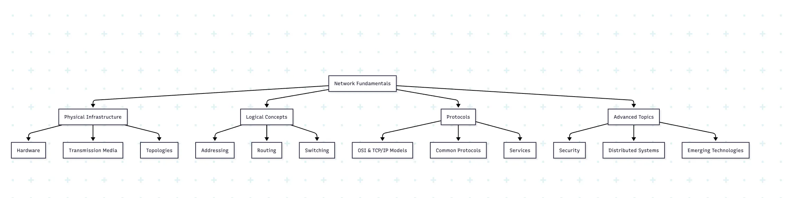

# Network Fundamentals Guide

# Introduction to Networking

A computer network is a system where multiple computing devices, often called nodes, are linked together for the purpose of communication, collaboration, and resource sharing. Networks enable devices like computers, servers, smartphones, and IoT devices to exchange data and access shared resources such as printers, storage, and internet services. To achieve this, networks rely on communication protocols—standardized rules and conventions that ensure devices can understand each other regardless of manufacturer or underlying hardware.

Networking can be established via wired connections (Ethernet, fiber optics) that provide stability and high speed, or wireless connections (Wi-Fi, Bluetooth, satellite) that offer mobility and convenience. Networks are the foundation of the modern digital world, supporting everything from personal messaging apps to global-scale cloud services.

## Key Networking Concepts

### Network Types by Scale

- **Personal Area Network (PAN):** The smallest type of network, PANs typically connect devices within a few meters—such as smartphones, laptops, wearables, and printers. Bluetooth and infrared are most common. Examples: syncing a smartwatch to a phone, or connecting wireless earbuds.
- **Local Area Network (LAN):** LANs cover limited areas like homes, offices, schools, or data centers. They are widely used to interconnect devices for file sharing, local gaming, or centralized network printing. Ethernet cables and Wi-Fi form the backbone of LANs. Characteristics include high speed (up to gigabits per second) and private ownership.
- **Metropolitan Area Network (MAN):** Larger than LANs, they usually connect multiple LANs across a city or metropolitan region. Examples: city-wide government, university networks, or large business campuses. Technologies like Metro Ethernet and fiber optics are commonly used.
- **Wide Area Network (WAN):** WANs extend over large distances, often spanning multiple countries and continents. The most famous example is the Internet itself. WANs use routers and leased telecommunication lines to interconnect smaller networks. They emphasize scalability, reliability, and long-distance data transport.

### Network Topologies

Network topology refers to the arrangement of elements within a network. The layout of connections between nodes influences performance, fault tolerance, and ease of troubleshooting.

- Physical Topologies
    - **Bus:** A single backbone cable connects all devices. Cheap and simple, but if the backbone fails, the network collapses. Rare in modern use.
    - **Ring:** Devices form a circle, with each device connected to two others. Data travels in one direction. Provides equal data access but is vulnerable if one node fails.
    - **Star:** Each device connects to a central hub or switch. Failure of one node does not affect others, but the hub is a single point of failure. Widely used in Ethernet LANs.
    - **Mesh:** Every node connects to multiple others. Offers high redundancy and reliability but is expensive and complex. Used in mission-critical and military applications.
    - **Tree/Hierarchical:** A layered star-like structure. Found in large organizations and ISPs with structured branching.
    - **Hybrid:** Combination of two or more topologies, allowing flexible deployment in enterprise systems.

## The OSI Model

The Open Systems Interconnection (OSI) model is a conceptual framework that standardizes the functions of a telecommunication or computing system.  The OSI model is a **seven-layer abstraction** that standardizes how data travels over a network. Each layer handles a specific part of the communication process and interacts only with its adjacent layers.

1. **Physical:** Deals with cables, connectors, signaling (1s and 0s as electrical or optical signals). E.g., Ethernet cabling, fiber optics.
2. **Data Link:** Provides node-to-node reliability and error detection. Uses MAC addresses. E.g., Ethernet, PPP, Wi-Fi.
3. **Network:** Responsible for logical addressing and routing packets. E.g., IP, ICMP.
4. **Transport:** End-to-end communication, ensures reliability, sequencing, and flow control. E.g., TCP, UDP.
5. **Session:** Manages sessions between applications, handling start/stop of communication. E.g., NetBIOS, RPC.
6. **Presentation:** Data formatting, encryption, and compression for interoperability between systems. E.g., SSL/TLS, JPEG.
7. **Application:** Supports user-facing services such as email, web browsing, and file transfer. E.g., HTTP, FTP, SMTP.

| **Layer** | **Name** | **Function** | **Examples** |
| --- | --- | --- | --- |
| 7 | Application | User interface and application access | HTTP, SMTP, FTP, DNS |
| 6 | Presentation | Data translation, encryption, compression | SSL/TLS, JPEG, MPEG |
| 5 | Session | Establishes, manages, and terminates connections | NetBIOS, RPC |
| 4 | Transport | End-to-end connections, reliability, flow control | TCP, UDP |
| 3 | Network | Logical addressing and routing | IP, ICMP, routing protocols |
| 2 | Data Link | Physical addressing and media access | Ethernet, MAC, PPP |
| 1 | Physical | Transmission of raw bit streams | Cables, hubs, repeaters |

## TCP/IP Model

The TCP/IP model is a more practical, condensed version of the OSI model, used in real-world network implementations. Unlike the OSI model, the TCP/IP model is implementation-driven and forms the foundation of today’s Internet:

- **Application Layer:** Combines OSI layers 5–7. Supports high-level protocols (HTTP, FTP, DNS).
- **Transport Layer:** Provides communication services like TCP (reliable) or UDP (fast but unreliable).
- **Internet Layer:** Equivalent to OSI’s Network Layer. Routing with IP and ICMP happens here.
- **Network Interface Layer:** Covers OSI layers 1–2, dealing with hardware addressing and data framing.

| **Layer** | **Equivalent OSI Layers** | **Protocols/Functions** |
| --- | --- | --- |
| Application | 5-7 (Session, Presentation, Application) | HTTP, FTP, SMTP, DNS, Telnet |
| Transport | 4 (Transport) | TCP, UDP |
| Internet | 3 (Network) | IP, ICMP, ARP, IGMP |
| Network Interface | 1-2 (Physical, Data Link) | Ethernet, Token Ring, PPP |

# Network Addressing

## IP Addressing

IP addresses uniquely identify devices on a network. There are two main versions in use:

### IPv4

- Most widely deployed, with a 32-bit address scheme producing ~4.3B unique addresses. Structured into classes (A, B, C). Uses subnet masks to divide networks. Example: home router IP 192.168.0.1.
- **Format:** 32-bit address written as four decimal numbers separated by periods (e.g., 192.168.1.1).
- **Address Space:** Approximately 4.3 billion unique addresses.
- **Classes:** Traditionally divided into classes A, B, C, D, and E.
- **Subnetting:** Process of dividing a network into smaller networks using subnet masks.

### IPv6

- Developed to overcome IPv4 exhaustion. Uses 128-bit addresses for enormous address space (2^128). Features auto-configuration, stronger security, and better routing efficiency. Example: 2001:0db8::1.
- **Format:** 128-bit address written as eight groups of four hexadecimal digits (e.g., 2001:0db8:85a3:0000:0000:8a2e:0370:7334).
- **Address Space:** 2^128 addresses (340 undecillion).
- **Features:** Auto-configuration, simplified header, improved security, and better multicast support.

## MAC Addressing

Media Access Control (MAC) addresses are hardware addresses uniquely identifying each device on a network. Unlike IP, which is logical and reconfigurable, a MAC address is a *hardware-embedded unique identifier* for network adapters. Used within a LAN for device recognition. Format is hex notation (00:1A:7D:9B:2F:3B).

- **Format:** 48-bit address typically written as six groups of two hexadecimal digits (e.g., 00:1A:2B:3C:4D:5E).
- **Assignment:** Assigned by manufacturers and should be globally unique.

# Core Network Protocols

- **TCP:** Reliable, connection-oriented protocol. Provides sequence numbers, error correction, and flow control. The famous **Three-Way Handshake** (SYN, SYN-ACK, ACK) establishes connections. Used for web, email, file transfers.
- **UDP:** Connectionless, faster, lightweight, but unreliable. Suited for real-time apps like video calls, gaming, DNS queries.
- **IP:** Manages addressing and routing packets between networks. Works on a “best-effort” delivery system.
- **ICMP:** Vital for error handling and diagnostics (used in ping and traceroute).
- **ARP:** Maps logical IP addresses to hardware MAC addresses on local networks.

## Transport Layer Protocols

### Transmission Control Protocol (TCP)

- **Connection-oriented:** Establishes a connection before transmitting data.
- **Reliable:** Ensures data delivery through acknowledgments and retransmissions.
- **Flow Control:** Prevents overwhelming receivers with too much data.
- **Congestion Control:** Adjusts to network congestion.
- **Use Cases:** Web browsing (HTTP), email (SMTP), file transfer (FTP).
- TCP Three-Way Handshake Process
    1. Client sends SYN packet to server.
    2. Server responds with SYN-ACK packet.
    3. Client sends ACK packet, establishing the connection.

### User Datagram Protocol (UDP)

- **Connectionless:** No prior connection establishment.
- **Unreliable:** No guarantee of delivery, ordering, or duplicate protection.
- **Lightweight:** Minimal overhead and latency.
- **Use Cases:** Streaming media, online gaming, DNS lookups.

## Internet Layer Protocols

### Internet Protocol (IP)

- **Function:** Addressing and routing packets across networks.
- **Connectionless:** Each packet is treated independently.
- **Best-Effort Delivery:** No guarantee of packet delivery.

### Internet Control Message Protocol (ICMP)

- **Function:** Error reporting and diagnostics.
- **Common Uses:** Ping (echo request/reply), traceroute.

### Address Resolution Protocol (ARP)

- **Function:** Maps IP addresses to MAC addresses on local networks.
- **Process:** Broadcasts requests and caches responses.

# Network Hardware

- **Hub/Repeater:** Amplifies signals but broadcasts to all devices, causing inefficiency.
- **Switch:** Smarter than hubs; forwards frames using MAC addresses, increasing efficiency.
- **Router:** Directs packets across different networks using IP addresses.
- **Firewall:** Controls traffic based on security rules. Hardware and software firewalls both exist.
- **Gateway:** Bridges entirely different protocols (e.g., VoIP network to traditional phone line).

Transmission media includes copper (UTP/STP cables), coaxial cable, fiber optics (high-bandwidth light transmission), and wireless media (RF, infrared, satellites).

## Connectivity Devices

| **Device** | **OSI Layer** | **Function** |
| --- | --- | --- |
| Repeater/Hub | Physical (1) | Amplifies or regenerates signals; broadcasts to all ports |
| Bridge | Data Link (2) | Connects network segments, filters by MAC address |
| Switch | Data Link (2) | Connects devices, forwards frames based on MAC addresses |
| Router | Network (3) | Connects networks, forwards packets based on IP addresses |
| Gateway | Various (3-7) | Connects different network architectures or protocols |
| Firewall | Various (3-7) | Filters traffic based on security rules |

## Transmission Media

### Wired Media

- **Twisted Pair:** Common in Ethernet networks (UTP/STP).
- **Coaxial Cable:** Used in cable TV and some older networks.
- **Fiber Optic:** Uses light for high-speed, long-distance transmission.

### Wireless Media

- **Radio Frequencies:** Used in Wi-Fi, cellular networks.
- **Infrared:** Short-range line-of-sight communication.
- **Microwave:** Point-to-point high-speed communication.
- **Satellite:** Global coverage for remote areas.

# Routing and Switching

- **Switching:** Decides how frames travel within LANs. Store-and-forward switching ensures error checking, cut-through switching boosts performance, and fragment-free switching balances both.
- **Routing:** Involves IP-level decision making to direct packets efficiently. Routers build **routing tables** using metrics like hop count or bandwidth. Protocols include RIP, OSPF, IS-IS, and BGP (for inter-domain Internet routing).

## Switching Methods

- **Store-and-Forward:** Switch receives entire frame before forwarding, can check for errors.
- **Cut-Through:** Switch begins forwarding after reading destination MAC address, reducing latency.
- **Fragment-Free:** Hybrid approach that checks for collisions before forwarding.

## Routing Concepts

- **Routing Tables:** Maps of network destinations and metrics.
- **Default Gateway:** Router used to exit local network.
- **Administrative Distance:** Trustworthiness of routing information sources.
- **Metrics:** Values used to determine optimal paths (hop count, bandwidth, delay, etc.).

## Routing Protocols

### Interior Gateway Protocols (IGPs)

- **Distance Vector:** RIP, EIGRP - Share knowledge of distance to destinations.
- **Link State:** OSPF, IS-IS - Build complete topology maps.

### Exterior Gateway Protocols (EGPs)

- **Border Gateway Protocol (BGP):** The core routing protocol of the Internet.

# Network Services

- **DNS:** Translates human-readable names (google.com) into IP addresses. Uses a hierarchy: root → TLD (.com, .org) → authoritative server.
- **DHCP:** Dynamically assigns devices their IP, subnet mask, and DNS server, avoiding manual configuration.
- **NAT:** Maps private IPs (used inside LANs) to public IPs for Internet connectivity. Provides security and address conservation.

## Domain Name System (DNS)

DNS translates human-readable domain names (e.g., [example.com](http://example.com)) into IP addresses.

- **Hierarchy:** Root servers, TLD servers, authoritative servers.
- **Record Types:** A, AAAA, MX, CNAME, TXT, NS, etc.
- **Resolution Process:** Recursive or iterative queries to resolve names.

## Dynamic Host Configuration Protocol (DHCP)

DHCP automatically assigns IP addresses and network configuration to devices.

- **Process:** DHCP Discover, Offer, Request, Acknowledge (DORA).
- **Configuration:** Provides IP address, subnet mask, default gateway, DNS servers.

## Network Address Translation (NAT)

NAT modifies IP address information in packet headers while in transit.

- **Purpose:** Conserve IPv4 addresses, provide basic security.
- **Types:** Static NAT, Dynamic NAT, PAT (Port Address Translation).

# Network Security

Foundational principles: **confidentiality, integrity, availability** (CIA triad). Security mechanisms include:

- Firewalls, IDS/IPS systems, and VPN tunnels.
- Encryption and PKI frameworks for secure communications.
- Threats like phishing, DoS, malware, and man-in-the-middle attacks.

## Security Concepts

- **Confidentiality:** Ensuring data is accessible only to authorized users.
- **Integrity:** Maintaining and assuring accuracy and consistency of data.
- **Availability:** Ensuring systems remain operational and accessible.
- **Authentication:** Verifying the identity of users or systems.
- **Authorization:** Determining access rights to resources.
- **Accounting:** Tracking resource usage for billing or security.

## Security Technologies

- **Firewalls:** Filter traffic based on predefined rules.
- **Intrusion Detection/Prevention Systems (IDS/IPS):** Monitor for suspicious activities.
- **Virtual Private Networks (VPNs):** Secure connections over public networks.
- **Encryption:** Converts data into a code to prevent unauthorized access.
- **Public Key Infrastructure (PKI):** Framework for managing digital certificates.

## Common Threats

- **Malware:** Malicious software (viruses, worms, trojans, ransomware).
- **Denial of Service (DoS):** Overwhelms resources to disrupt services.
- **Man-in-the-Middle:** Intercepts and potentially alters communications.
- **Social Engineering:** Manipulates people to divulge confidential information.
- **Phishing:** Attempts to obtain sensitive information by disguising as trustworthy entities.

# Wireless Networking

## Wi-Fi Standards

| **Standard** | **Frequency** | **Max Speed** | **Range** |
| --- | --- | --- | --- |
| 802.11a | 5 GHz | 54 Mbps | ~35m indoors |
| 802.11b | 2.4 GHz | 11 Mbps | ~35m indoors |
| 802.11g | 2.4 GHz | 54 Mbps | ~38m indoors |
| 802.11n (Wi-Fi 4) | 2.4/5 GHz | 600 Mbps | ~70m indoors |
| 802.11ac (Wi-Fi 5) | 5 GHz | 3.5 Gbps | ~35m indoors |
| 802.11ax (Wi-Fi 6) | 2.4/5/6 GHz | 9.6 Gbps | ~35m indoors |

## Wireless Security

- **WEP:** Older, insecure encryption method.
- **WPA/WPA2/WPA3:** Progressive improvements in wireless security.
- **802.1X:** Port-based network access control.
- **MAC Filtering:** Restricts access based on device MAC addresses.

# Advanced Networking Concepts

## Quality of Service (QoS)

QoS refers to the ability to prioritize different types of traffic to ensure performance for critical applications.  Ensures critical traffic (VoIP, healthcare apps) receives priority over less urgent traffic.

- **Classification:** Identifying and marking traffic types.
- **Queuing:** Managing how packets wait for transmission.
- **Congestion Management:** Handling network overload situations.
- **Traffic Shaping:** Controlling bandwidth usage and timing.

## Virtual LANs (VLANs)

VLANs logically segment a physical network into multiple broadcast domains. Divide a physical LAN into logical groups for security and performance.

- **Benefits:** Improved security, traffic management, and reduced broadcast traffic.
- **VLAN Tagging:** IEEE 802.1Q standard for frame identification.
- **Trunking:** Carrying multiple VLANs over a single link.

## Software-Defined Networking (SDN)

SDN separates the network control plane from the data forwarding plane. Uses centralized controllers to manage forwarding logic of networking devices, enabling easier scale and automation.

- **Architecture:** Application, control, and infrastructure layers.
- **Benefits:** Centralized management, programmability, abstraction.
- **OpenFlow:** Common protocol for SDN controller-switch communication.

# Distributed Systems Networking

- Common structures include **client-server, peer-to-peer, three-tier, microservices** architectures.
- Communication techniques include RPC, REST APIs, publish-subscribe models.
- Challenges like replication, consistency, fault tolerance, and consensus (e.g., Paxos, Raft) are central to distributed design.
- Distributed file systems such as HDFS and GFS store massive amounts of data for big data processing.

## Fundamental Concepts

- **Distributed System:** Collection of independent computers appearing as a single coherent system.
- **Challenges:** Heterogeneity, openness, security, scalability, failure handling, concurrency, transparency.

## Architectural Models

- **Client-Server:** Clients request services from centralized servers.
- **Peer-to-Peer:** Equal participants sharing resources directly.
- **Three-Tier:** Presentation, application logic, and data management layers.
- **Microservices:** Small, independent services communicating via APIs.

## Communication Paradigms

- **Remote Procedure Call (RPC):** Allows programs to execute procedures on remote systems.
- **Message-Oriented Middleware (MOM):** Asynchronous message passing between distributed components.
- **Publish-Subscribe:** Publishers send messages without specific recipients; subscribers express interest in topics.
- **RESTful Communication:** Stateless client-server communication using HTTP methods.

## Consistency and Replication

- **Data Replication:** Maintaining copies of data across multiple locations.
- **Consistency Models:** Strong, eventual, causal, sequential consistency.
- **CAP Theorem:** Consistency, Availability, Partition Tolerance - you can only guarantee two out of three.

## Distributed Consensus

Algorithms to achieve agreement among distributed processes:

- **Paxos:** Classic consensus protocol for distributed systems.
- **Raft:** Designed to be more understandable than Paxos.
- **Byzantine Fault Tolerance:** Handles malicious failures in addition to crashes.

## Distributed File Systems

- **Network File System (NFS):** Allows remote file access across networks.
- **Hadoop Distributed File System (HDFS):** Designed for large datasets and streaming access.
- **Google File System (GFS)/Colossus:** Scalable distributed file system for large clusters.

## Distributed Computing Models

- **MapReduce:** Programming model for processing large datasets in parallel.
- **Bulk Synchronous Parallel (BSP):** Computation proceeds in synchronized steps.
- **Actor Model:** Concurrent computation with actors as universal primitives.

## Cloud Networking

- **Virtual Networks:** Software-defined networks in cloud environments.
- **Network Function Virtualization (NFV):** Virtualizes network services traditionally run on proprietary hardware.
- **Content Delivery Networks (CDNs):** Distributed server networks that deliver content based on geographic location.
- **Multi-Cloud Networking:** Connecting resources across multiple cloud providers.

## Distributed System Challenges

- **Clock Synchronization:** Maintaining consistent time across distributed systems.
- **Deadlock Detection:** Identifying resource conflicts in distributed environments.
- **Load Balancing:** Distributing workloads across multiple computing resources.
- **Fault Tolerance:** Ensuring system functionality despite component failures.
- **Distributed Monitoring:** Observing health and performance across distributed components.

# Emerging Network Technologies

- **5G:** Brings ultra-low latency, high bandwidth, and network slicing for specialized workloads like IoT and AR/VR.
- **IoT Networking:** Relies on lightweight protocols (MQTT, CoAP) and low-power standards like Zigbee. Edge computing reduces latency by processing data near the source.
- **Network Function Virtualization (NFV):** Virtualizes firewalls, load balancers, and other functions, reducing costs and increasing scalability.

## 5G and Beyond

- **Enhanced Mobile Broadband:** Gigabit-level speeds.
- **Ultra-Reliable Low Latency Communication:** For critical applications.
- **Massive Machine Type Communication:** Supporting IoT scale.
- **Network Slicing:** Multiple virtual networks on shared infrastructure.

## Internet of Things (IoT) Networking

- **Low-Power Protocols:** Bluetooth LE, Zigbee, Z-Wave, LoRaWAN.
- **Edge Computing:** Processing data closer to the source.
- **Fog Computing:** Layer between edge and cloud.
- **MQTT and CoAP:** Lightweight communication protocols for constrained devices.

## Network Function Virtualization (NFV)

NFV separates network functions from proprietary hardware to run them as software.

- **Benefits:** Reduced costs, scalability, faster service deployment.
- **Components:** Virtual Network Functions (VNFs), NFV Infrastructure, Management and Orchestration.

# Summary and Best Practices

Network fundamentals form the backbone of modern computing infrastructure. From basic concepts like addressing and protocols to advanced topics in distributed systems, understanding these principles is crucial for designing, implementing, and troubleshooting networks of any scale.

As technology continues to evolve, networking professionals must stay current with emerging standards and methodologies while maintaining a solid grasp of the foundational concepts that remain consistent regardless of implementation details.

## Best Practices

- **Documentation:** Maintain thorough and updated network documentation.
- **Standardization:** Follow established protocols and standards.
- **Security:** Implement defense-in-depth strategies.
- **Redundancy:** Design networks with appropriate redundancy to avoid single points of failure.
- **Performance Monitoring:** Continuously monitor network performance and establish baselines.
- **Regular Updates:** Keep firmware and software updated.
- **Change Management:** Follow structured processes for network changes.
- **Training:** Ensure staff maintains current knowledge of network technologies.