# Table of Contents

- [Introduction to Generative AI](#introduction)
- [Prerequisites and Setup](#prerequisites)
- [Frameworks and Libraries](#frameworks)
- [Basic Concepts](#basics)
- [Common Architectures](#architectures)
- [Mnemonic Memory in AI Systems](#memory)
- [Implementing a Basic Generative AI Model](#implementation)
- [Training Methodologies](#training)
- [Evaluation Metrics](#evaluation)
- [Advanced Techniques](#advanced)
- [Additional Resources](#resources)

# Introduction to Generative AI

Generative AI refers to artificial intelligence systems capable of generating new content - including text, images, audio, code, and more - based on patterns learned from training data. Unlike discriminative models that classify or predict outcomes based on input, generative models learn the underlying data distribution to create novel outputs that resemble the training data.

## Theoretical Foundations of Generative AI

### Information Theory and Generative Models

Generative AI is fundamentally grounded in information theory, which provides the mathematical framework for understanding how information is encoded, transmitted, and decoded.

**Key Theoretical Concepts:**

- **Entropy:** Measures the uncertainty or randomness in a dataset. For a discrete random variable X with probability mass function p(x):

```
H(X) = -∑ p(x) log₂ p(x)
```

- **Cross-Entropy:** Measures the difference between two probability distributions. Used as a loss function in many generative models.
- **Kullback-Leibler (KL) Divergence:** Measures how one probability distribution diverges from another:

```
D_KL(P||Q) = ∑ P(x) log(P(x)/Q(x))
```

- **Mutual Information:** Quantifies the amount of information obtained about one variable through another.

### Bayesian Inference in Generation

Generative models often employ Bayesian principles to model uncertainty and make probabilistic inferences.

**Bayes' Theorem in Generative Modeling:**

```
P(parameters|data) = P(data|parameters) × P(parameters) / P(data)
```

Where:

- P(parameters|data) is the posterior distribution
- P(data|parameters) is the likelihood
- P(parameters) is the prior distribution
- P(data) is the marginal likelihood (evidence)

### Mathematical Foundations of Neural Networks

Understanding the theoretical basis of neural networks is crucial for generative AI development.

**Universal Approximation Theorem:** Neural networks with at least one hidden layer can approximate any continuous function on a compact set to arbitrary accuracy, given sufficient neurons.

**Backpropagation Theory:** Based on the chain rule of calculus, backpropagation computes gradients efficiently through computational graphs:

```
∂L/∂w = ∂L/∂y × ∂y/∂w
```

## Key Concepts in Generative AI

- **Data Distribution Learning:** Generative models aim to understand and replicate the probability distribution of training data.
- **Latent Space:** An abstract representation where similar data points are positioned close together, enabling interpolation and manipulation.
- **Conditional Generation:** Creating outputs based on specific input criteria or conditions.
- **Transfer Learning:** Leveraging knowledge gained from one task to improve knowledge gained from one task to improve performance on another.
- **Fine-tuning:** Adapting pre-trained models to specific domains or tasks.

## Applications of Generative AI

- Text generation (stories, articles, code, etc.)
- Image and video synthesis
- Music and audio creation
- Drug discovery and molecular design
- Content personalization
- Synthetic data generation
- Creative assistance tools

# Prerequisites and Setup

## Required Knowledge

- Intermediate Python programming
- Basic understanding of machine learning concepts
- Fundamentals of neural networks
- Basic statistics and probability
- Linear algebra fundamentals

## Development Environment Setup

```bash
# Create a virtual environment
python -m venv genai_env
source genai_env/bin/activate  # On Windows: genai_env\Scripts\activate

# Install essential packages
pip install numpy pandas matplotlib
pip install torch torchvision
pip install tensorflow
pip install transformers
pip install huggingface_hub
pip install scikit-learn
pip install jupyter

# For specialized tasks
pip install opencv-python  # For image processing
pip install librosa  # For audio processing

```

## Hardware Considerations

Generative AI models, especially larger ones, can be computationally intensive. Consider the following hardware requirements:

- **CPU Training:** Possible for small models but very slow
- **GPU Acceleration:** Highly recommended, NVIDIA GPUs with CUDA support work best
- **Memory Requirements:** 16GB+ RAM for development, more for larger models
- **Storage:** Fast SSD storage for model checkpoints and datasets
- **Cloud Options:** Google Colab, AWS, Azure, or GCP for training larger models

# Frameworks and Libraries

## Core Libraries

| **Library** | **Purpose** | **Key Features** |
| --- | --- | --- |
| PyTorch | Deep learning framework | Dynamic computation graphs, extensive ecosystem |
| TensorFlow | Deep learning framework | Production deployment, TensorBoard visualization |
| Hugging Face Transformers | NLP models and tools | Pre-trained models, fine-tuning, pipelines |
| JAX | High-performance computing | Accelerated numerical computing, functional approach |
| Keras | High-level neural networks API | User-friendly, rapid prototyping |

## Specialized Libraries

| **Library** | **Purpose** | **Key Features** |
| --- | --- | --- |
| Diffusers | Diffusion models | Image generation, text-to-image |
| Accelerate | Training optimization | Distributed training, mixed precision |
| DeepSpeed | Training optimization | Large model training, optimization |
| PyTorch Lightning | PyTorch organization | Structured code, research-friendly |
| Gradio | Demo creation | Interactive interfaces for AI models |
| PEFT | Parameter-Efficient Fine-Tuning | LoRA, adapters, efficient training |

# Basic Concepts

## Understanding Data Representations

Before diving into generative models, it's crucial to understand how different types of data are represented:

- **Text:** Tokenization, embeddings, sequence representation
- **Images:** Pixel matrices, channels, normalization
- **Audio:** Waveforms, spectrograms, mel-frequency cepstral coefficients (MFCCs)
- **Categorical Data:** One-hot encoding, embedding spaces

## Probabilistic Foundation

Generative models are fundamentally about probability distributions:

```python
# Conceptual example: 
# A generative model aims to learn P(X), the probability distribution of data X
# Or P(X|Y) for conditional generation, where Y is a condition

import numpy as np
import matplotlib.pyplot as plt
from scipy import stats

# Example: Learning a Gaussian distribution
mu, sigma = 0, 0.1
s = np.random.normal(mu, sigma, 1000)

# Visualize the learned distribution
count, bins, ignored = plt.hist(s, 30, density=True)
plt.plot(bins, 1/(sigma * np.sqrt(2 * np.pi)) * np.exp(-(bins - mu)**2 / (2 * sigma**2)), linewidth=2)
plt.title("Gaussian Distribution: What a Generative Model Might Learn")
plt.show()

```

## Latent Space Representation

Many generative models operate by learning a lower-dimensional "latent space" that captures the essential features of the data:

- **Dimensionality Reduction:** Compress high-dimensional data into a more manageable representation
- **Manifold Learning:** Discover the underlying structure or "manifold" of the data
- **Interpolation:** Move smoothly between points in latent space to generate new samples
- **Disentanglement:** Separate different factors of variation in the data

```python
# Conceptual example of latent space operations
# In practice, this would be done with neural networks

import numpy as np
from sklearn.decomposition import PCA
import matplotlib.pyplot as plt

# Simulate high-dimensional data
data = np.random.randn(1000, 100)  # 1000 samples, 100 dimensions

# Learn a latent space using PCA
pca = PCA(n_components=2)
latent_points = pca.fit_transform(data)

# Visualize the latent space
plt.figure(figsize=(10, 8))
plt.scatter(latent_points[:, 0], latent_points[:, 1], alpha=0.5)
plt.title("2D Latent Space Representation")
plt.xlabel("Latent Dimension 1")
plt.ylabel("Latent Dimension 2")
plt.show()

# Generate new points by sampling from latent space
new_latent_points = np.random.randn(5, 2)  # 5 new points in latent space
# Transform back to original space (reconstruct)
new_samples = pca.inverse_transform(new_latent_points)

```

# Common Architectures

## Generative Adversarial Networks (GANs)

### Theoretical Foundation of GANs

GANs are based on game theory, specifically a two-player minimax game. The theoretical framework can be expressed as:

**Minimax Objective:**

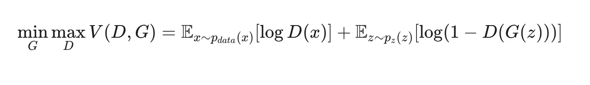

Where:

- G is the generator function
- D is the discriminator function
- p_data(x) is the real data distribution
- p_z(z) is the noise distribution

**Nash Equilibrium:** The optimal solution occurs when:

- Generator G produces samples indistinguishable from real data
- Discriminator D cannot distinguish between real and generated samples (outputs 0.5 for all inputs)
- At equilibrium: p_g = p_data (generator distribution equals data distribution)

**Theoretical Guarantees:**

- Global optimum exists when p_g = p_data
- At optimum, discriminator outputs D*(x) = 1/2 for all x
- The minimax game has a unique global optimum

**Training Dynamics:**

The alternating optimization can be viewed as:

1. **Discriminator Step:**

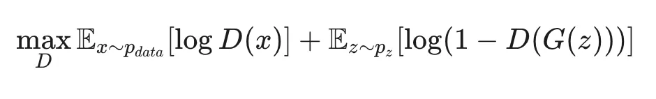

1. **Generator Step:**

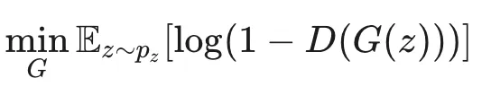

### Theoretical Foundation of VAEs

VAEs are grounded in variational inference and probabilistic modeling theory.

**Variational Lower Bound (ELBO):**

The VAE objective maximizes the Evidence Lower Bound:

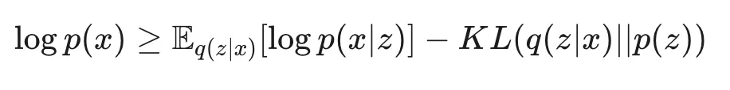

Where:

- q(z|x) is the approximate posterior (encoder)
- p(x|z) is the likelihood (decoder)
- p(z) is the prior distribution (usually N(0,I))

**Reparameterization Trick:**

To enable backpropagation through stochastic sampling:

```
z = μ + σ ⊙ ε, where ε ~ N(0,I)
```

This transforms sampling from q(z|x) = N(μ,σ²) into a deterministic function of ε.

### Theoretical Foundation of Diffusion Models

Diffusion models are based on stochastic differential equations and reverse-time processes.

**Forward Process (Adding Noise):**

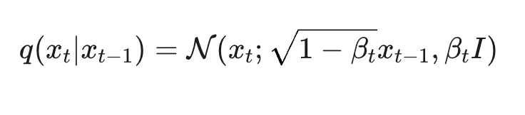

**Reverse Process (Denoising):**

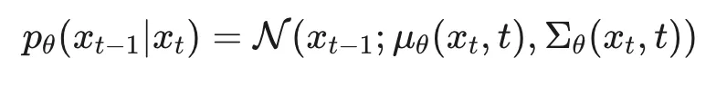

**Training Objective:**

The model learns to predict the noise ε added at each timestep:

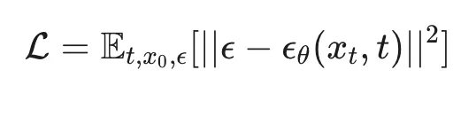

Where,

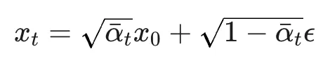

**Score-Based Perspective:**

Diffusion models can be viewed as learning the score function ∇_x log p(x_t), which points toward higher density regions.

### Theoretical Foundation of Transformers

Transformers are built on attention mechanisms with strong theoretical foundations.

**Self-Attention Mathematics:**

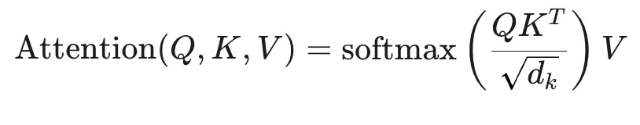

Where:

- Q, K, V are query, key, and value matrices
- d_k is the key dimension for scaling
- Softmax creates a probability distribution over positions

**Multi-Head Attention:**

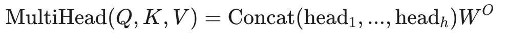

where,

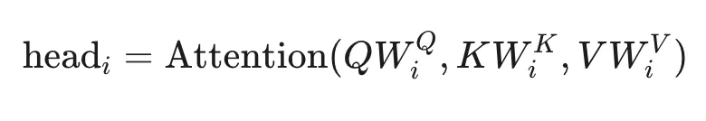

**Positional Encoding Theory:**

Since attention is permutation-invariant, positional encodings inject sequence order:

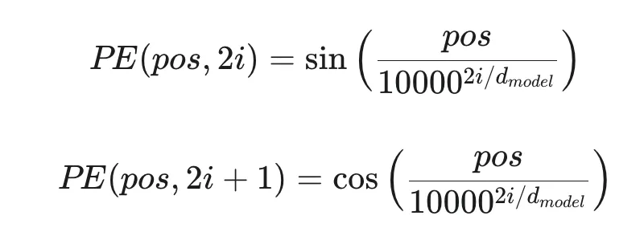

**Universal Approximation for Sequences:**

Transformers with sufficient capacity can approximate any sequence-to-sequence function.

## Generative Adversarial Networks (GANs)

GANs consist of two neural networks - a generator and a discriminator - that compete against each other in a min-max game:

- **Generator:** Creates fake samples to fool the discriminator
- **Discriminator:** Tries to distinguish between real and fake samples
- **Training Process:** Alternating updates to both networks

```python
import torch
import torch.nn as nn
import torch.optim as optim

# Simple GAN implementation
class Generator(nn.Module):
    def __init__(self, latent_dim, output_dim):
        super(Generator, self).__init__()
        self.model = nn.Sequential(
            nn.Linear(latent_dim, 128),
            nn.ReLU(),
            nn.Linear(128, 256),
            nn.ReLU(),
            nn.Linear(256, output_dim),
            nn.Tanh()  # Output in range [-1, 1]
        )
        
    def forward(self, z):
        return self.model(z)

class Discriminator(nn.Module):
    def __init__(self, input_dim):
        super(Discriminator, self).__init__()
        self.model = nn.Sequential(
            nn.Linear(input_dim, 256),
            nn.LeakyReLU(0.2),
            nn.Linear(256, 128),
            nn.LeakyReLU(0.2),
            nn.Linear(128, 1),
            nn.Sigmoid()  # Output probability between 0 and 1
        )
        
    def forward(self, x):
        return self.model(x)

# Training setup
latent_dim = 100
data_dim = 784  # For MNIST (28x28)
generator = Generator(latent_dim, data_dim)
discriminator = Discriminator(data_dim)

# Optimizers
g_optimizer = optim.Adam(generator.parameters(), lr=0.0002, betas=(0.5, 0.999))
d_optimizer = optim.Adam(discriminator.parameters(), lr=0.0002, betas=(0.5, 0.999))

# Loss function
criterion = nn.BCELoss()

# Training loop (conceptual)
def train_gan(epochs, dataloader):
    for epoch in range(epochs):
        for real_data in dataloader:
            batch_size = real_data.size(0)
            
            # Train Discriminator
            d_optimizer.zero_grad()
            
            # Real data
            real_predictions = discriminator(real_data)
            real_loss = criterion(real_predictions, torch.ones(batch_size, 1))
            
            # Fake data
            z = torch.randn(batch_size, latent_dim)
            fake_data = generator(z)
            fake_predictions = discriminator(fake_data.detach())
            fake_loss = criterion(fake_predictions, torch.zeros(batch_size, 1))
            
            # Combined loss and update
            d_loss = real_loss + fake_loss
            d_loss.backward()
            d_optimizer.step()
            
            # Train Generator
            g_optimizer.zero_grad()
            z = torch.randn(batch_size, latent_dim)
            fake_data = generator(z)
            fake_predictions = discriminator(fake_data)
            g_loss = criterion(fake_predictions, torch.ones(batch_size, 1))
            g_loss.backward()
            g_optimizer.step()
            
        print(f"Epoch {epoch}: D Loss: {d_loss.item()}, G Loss: {g_loss.item()}")

```

## Variational Autoencoders (VAEs)

VAEs learn to encode data into a probability distribution in latent space and then decode from that space:

- **Encoder:** Maps input data to parameters of a probability distribution (usually Gaussian)
- **Latent Space:** A stochastic representation where samples are drawn
- **Decoder:** Reconstructs data from latent samples
- **Loss Function:** Combines reconstruction loss and KL divergence

```python
import torch
import torch.nn as nn
import torch.nn.functional as F

class VAE(nn.Module):
    def __init__(self, input_dim, latent_dim):
        super(VAE, self).__init__()
        
        # Encoder
        self.fc1 = nn.Linear(input_dim, 512)
        self.fc2_mu = nn.Linear(512, latent_dim)     # Mean layer
        self.fc2_logvar = nn.Linear(512, latent_dim) # Log variance layer
        
        # Decoder
        self.fc3 = nn.Linear(latent_dim, 512)
        self.fc4 = nn.Linear(512, input_dim)
        
    def encode(self, x):
        h = F.relu(self.fc1(x))
        mu = self.fc2_mu(h)
        logvar = self.fc2_logvar(h)
        return mu, logvar
    
    def reparameterize(self, mu, logvar):
        std = torch.exp(0.5 * logvar)
        eps = torch.randn_like(std)
        z = mu + eps * std
        return z
    
    def decode(self, z):
        h = F.relu(self.fc3(z))
        return torch.sigmoid(self.fc4(h))
    
    def forward(self, x):
        mu, logvar = self.encode(x)
        z = self.reparameterize(mu, logvar)
        reconstruction = self.decode(z)
        return reconstruction, mu, logvar

# Loss function
def vae_loss(reconstruction, x, mu, logvar):
    # Reconstruction loss (binary cross entropy for binary data like MNIST)
    recon_loss = F.binary_cross_entropy(reconstruction, x, reduction='sum')
    
    # KL divergence
    kl_loss = -0.5 * torch.sum(1 + logvar - mu.pow(2) - logvar.exp())
    
    return recon_loss + kl_loss

# Training loop (conceptual)
def train_vae(model, optimizer, data_loader, epochs):
    model.train()
    for epoch in range(epochs):
        total_loss = 0
        for batch_idx, (data, _) in enumerate(data_loader):
            data = data.view(data.size(0), -1)  # Flatten images
            optimizer.zero_grad()
            
            reconstruction, mu, logvar = model(data)
            loss = vae_loss(reconstruction, data, mu, logvar)
            
            loss.backward()
            optimizer.step()
            
            total_loss += loss.item()
            
        avg_loss = total_loss / len(data_loader.dataset)
        print(f'Epoch {epoch}, Average Loss: {avg_loss:.4f}')

```

## Transformer Models

Transformers have revolutionized generative AI, especially for sequential data like text:

- **Self-Attention Mechanism:** Allows the model to weigh the importance of different parts of the input
- **Parallelization:** Process all tokens simultaneously, unlike RNNs
- **Scaling:** Can be scaled to billions of parameters
- **Transfer Learning:** Pre-trained models can be fine-tuned for specific tasks

```python
# Using Hugging Face Transformers for a generative model
from transformers import GPT2LMHeadModel, GPT2Tokenizer

# Load pre-trained model and tokenizer
model_name = "gpt2"  # Can be gpt2, gpt2-medium, gpt2-large, etc.
tokenizer = GPT2Tokenizer.from_pretrained(model_name)
model = GPT2LMHeadModel.from_pretrained(model_name)

# Generate text
prompt = "Artificial intelligence is"
input_ids = tokenizer.encode(prompt, return_tensors="pt")

# Generate 50 tokens
output = model.generate(
    input_ids, 
    max_length=50, 
    num_return_sequences=1, 
    temperature=0.7,
    top_k=50, 
    top_p=0.95, 
    do_sample=True,
    no_repeat_ngram_size=2
)

generated_text = tokenizer.decode(output[0], skip_special_tokens=True)
print(generated_text)

```

## Diffusion Models

Diffusion models have emerged as powerful generative models, especially for images:

- **Forward Process:** Gradually adds noise to data
- **Reverse Process:** Learns to denoise data step by step
- **Conditioning:** Can be guided by additional information (e.g., text prompts)
- **Sampling:** Generate new data by starting from pure noise

```python
# Simplified implementation of a basic diffusion model
import torch
import torch.nn as nn
import torch.nn.functional as F

class SimpleDiffusionModel(nn.Module):
    def __init__(self, input_dim):
        super(SimpleDiffusionModel, self).__init__()
        # Simple UNet-like architecture for denoising
        self.encoder = nn.Sequential(
            nn.Linear(input_dim, 256),
            nn.SiLU(),
            nn.Linear(256, 128),
            nn.SiLU(),
        )
        
        self.time_embed = nn.Sequential(
            nn.Linear(1, 128),
            nn.SiLU(),
            nn.Linear(128, 128),
        )
        
        self.decoder = nn.Sequential(
            nn.Linear(128, 256),
            nn.SiLU(),
            nn.Linear(256, input_dim),
        )
        
    def forward(self, x, t):
        # Embed timestep
        t_emb = self.time_embed(t.unsqueeze(1).float())
        
        # Encode
        h = self.encoder(x)
        
        # Add time embedding
        h = h + t_emb
        
        # Decode
        return self.decoder(h)

# Training loop (conceptual)
def train_diffusion(model, optimizer, data_loader, epochs, noise_steps=1000, beta_start=1e-4, beta_end=0.02):
    # Define noise schedule
    betas = torch.linspace(beta_start, beta_end, noise_steps)
    alphas = 1. - betas
    alphas_cumprod = torch.cumprod(alphas, dim=0)
    
    for epoch in range(epochs):
        total_loss = 0
        for batch_idx, (data, _) in enumerate(data_loader):
            data = data.view(data.size(0), -1)  # Flatten images
            batch_size = data.shape[0]
            
            optimizer.zero_grad()
            
            # Sample timesteps
            t = torch.randint(0, noise_steps, (batch_size,))
            
            # Get noise and alphas for this timestep
            alpha_t = alphas_cumprod[t].view(-1, 1)
            
            # Add noise to data
            noise = torch.randn_like(data)
            noisy_data = torch.sqrt(alpha_t) * data + torch.sqrt(1 - alpha_t) * noise
            
            # Predict noise
            noise_pred = model(noisy_data, t)
            
            # Loss is how well we predict the noise
            loss = F.mse_loss(noise_pred, noise)
            
            loss.backward()
            optimizer.step()
            
            total_loss += loss.item()
            
        avg_loss = total_loss / len(data_loader)
        print(f'Epoch {epoch}, Average Loss: {avg_loss:.4f}')

# Sampling function (generate new data)
def sample(model, n_samples, input_dim, noise_steps=1000, beta_start=1e-4, beta_end=0.02):
    # Define noise schedule
    betas = torch.linspace(beta_start, beta_end, noise_steps)
    alphas = 1. - betas
    alphas_cumprod = torch.cumprod(alphas, dim=0)
    
    # Start from pure noise
    x = torch.randn(n_samples, input_dim)
    
    # Gradually denoise
    model.eval()
    with torch.no_grad():
        for t in reversed(range(noise_steps)):
            t_tensor = torch.ones(n_samples, dtype=torch.long) * t
            
            # Predict noise
            noise_pred = model(x, t_tensor)
            
            # Denoise step
            alpha_t = alphas_cumprod[t]
            alpha_t_prev = alphas_cumprod[t-1] if t > 0 else torch.tensor(1.)
            
            # Equations from DDPM paper
            beta_t = betas[t]
            
            if t > 0:
                noise = torch.randn_like(x)
            else:
                noise = 0
                
            x = (1 / torch.sqrt(alphas[t])) * (x - ((1 - alphas[t]) / torch.sqrt(1 - alpha_t)) * noise_pred) + torch.sqrt(beta_t) * noise
    
    return x  # Generated samples

```

# Mnemonic Memory in AI Systems

## Understanding Mnemonic Memory

Mnemonic memory in AI refers to systems that can store, retrieve, and utilize information in ways inspired by human memory processes. This approach enhances generative models by providing them with more explicit and structured storage of information.

### Types of AI Memory Systems

- **Short-term Memory:** Temporary storage for immediate context (like attention in transformers)
- **Long-term Memory:** Persistent storage of information (external databases, knowledge bases)
- **Episodic Memory:** Storage of specific experiences or sequences
- **Associative Memory:** Content-addressable storage allowing retrieval by related concepts

## Memory Mechanisms in Transformers

Transformer models inherently implement a form of working memory through their attention mechanisms:

```python
# Conceptual implementation of self-attention (core of transformer memory)
import torch
import torch.nn as nn
import torch.nn.functional as F
import math

class SelfAttention(nn.Module):
    def __init__(self, embed_size, heads):
        super(SelfAttention, self).__init__()
        self.embed_size = embed_size
        self.heads = heads
        self.head_dim = embed_size // heads
        
        assert (self.head_dim * heads == embed_size), "Embed size must be divisible by heads"
        
        # Linear projections for Q, K, V
        self.q_linear = nn.Linear(embed_size, embed_size)
        self.k_linear = nn.Linear(embed_size, embed_size)
        self.v_linear = nn.Linear(embed_size, embed_size)
        
        self.out = nn.Linear(embed_size, embed_size)
        
    def forward(self, q, k, v, mask=None):
        batch_size = q.size(0)
        
        # Linear projections and reshape for multi-head attention
        q = self.q_linear(q).view(batch_size, -1, self.heads, self.head_dim).permute(0, 2, 1, 3)
        k = self.k_linear(k).view(batch_size, -1, self.heads, self.head_dim).permute(0, 2, 1, 3)
        v = self.v_linear(v).view(batch_size, -1, self.heads, self.head_dim).permute(0, 2, 1, 3)
        
        # Attention scores: how each token attends to all other tokens
        # This is the core of the memory mechanism
        attention = torch.matmul(q, k.permute(0, 1, 3, 2)) / math.sqrt(self.head_dim)
        
        # Apply mask if provided (e.g., for causal attention)
        if mask is not None:
            attention = attention.masked_fill(mask == 0, float('-1e20'))
        
        # Softmax to get attention weights
        attention_weights = F.softmax(attention, dim=-1)
        
        # Apply attention weights to values
        out = torch.matmul(attention_weights, v).permute(0, 2, 1, 3).contiguous()
        out = out.view(batch_size, -1, self.embed_size)
        
        # Final linear layer
        return self.out(out)

```

## External Memory Systems

For more sophisticated mnemonic capabilities, generative models can be augmented with external memory systems:

### 1. Vector Databases for Knowledge Retrieval

```python
# Using vector databases for retrieval-augmented generation
import numpy as np
from sklearn.metrics.pairwise import cosine_similarity
import faiss  # Facebook AI Similarity Search

# Simulating a vector database
class VectorMemoryStore:
    def __init__(self, dimension):
        self.dimension = dimension
        self.index = faiss.IndexFlatL2(dimension)  # L2 distance index
        self.text_store = []  # Store actual text
        
    def add_memories(self, embeddings, texts):
        """Add embeddings and their corresponding texts to memory"""
        embeddings = np.array(embeddings).astype('float32')
        self.index.add(embeddings)
        self.text_store.extend(texts)
        
    def search(self, query_embedding, k=5):
        """Search for most similar memories"""
        query_embedding = np.array([query_embedding]).astype('float32')
        distances, indices = self.index.search(query_embedding, k)
        
        # Return relevant memories
        memories = [self.text_store[idx] for idx in indices[0]]
        return memories, distances[0]

# Using with a generative model
def retrieval_augmented_generation(query, gen_model, tokenizer, embed_model, memory_store):
    # Encode query to embedding
    query_embedding = embed_model.encode(query)
    
    # Retrieve relevant memories
    relevant_memories, _ = memory_store.search(query_embedding)
    
    # Augment prompt with memories
    augmented_prompt = "Based on the following information:\n"
    for i, memory in enumerate(relevant_memories):
        augmented_prompt += f"{i+1}. {memory}\n"
    augmented_prompt += f"\nQuery: {query}\nResponse:"
    
    # Generate response with augmented prompt
    input_ids = tokenizer.encode(augmented_prompt, return_tensors="pt")
    output = gen_model.generate(input_ids, max_length=200)
    response = tokenizer.decode(output[0], skip_special_tokens=True)
    
    return response

```

### 2. Neural Memory Networks

```python
# Implementation of a neural memory network
import torch
import torch.nn as nn
import torch.nn.functional as F

class MemoryNetwork(nn.Module):
    def __init__(self, input_dim, memory_dim, memory_size):
        super(MemoryNetwork, self).__init__()
        self.input_dim = input_dim
        self.memory_dim = memory_dim
        self.memory_size = memory_size
        
        # Memory cells
        self.memory = nn.Parameter(torch.randn(memory_size, memory_dim))
        
        # Input projector
        self.input_projector = nn.Linear(input_dim, memory_dim)
        
        # Output projector
        self.output_projector = nn.Linear(memory_dim, input_dim)
        
    def forward(self, x):
        # Project input to memory space
        x_proj = self.input_projector(x)
        
        # Calculate attention weights
        attention = F.softmax(torch.matmul(x_proj, self.memory.t()), dim=1)
        
        # Read from memory
        read_memory = torch.matmul(attention, self.memory)
        
        # Combine with input
        output = x + self.output_projector(read_memory)
        
        return output, attention
    
    def write_memory(self, x, erase_factor=0.3, add_factor=0.5):
        # Project input to memory space
        x_proj = self.input_projector(x)
        
        # Calculate attention weights
        attention = F.softmax(torch.matmul(x_proj, self.memory.t()), dim=1)
        
        # Erase and add operations
        erase = torch.matmul(attention.t(), torch.sigmoid(x_proj) * erase_factor)
        add = torch.matmul(attention.t(), torch.tanh(x_proj) * add_factor)
        
        # Update memory
        self.memory.data = self.memory * (1 - erase) + add
        
        return self.memory

```

### 3. Episodic Memory for Sequential Information

```python
# Implementation of episodic memory for dialogue or sequential tasks
class EpisodicMemory:
    def __init__(self, max_episodes=100):
        self.episodes = []
        self.max_episodes = max_episodes
        
    def add_episode(self, episode):
        """Add a new episode (conversation, sequence, etc.)"""
        if len(self.episodes) >= self.max_episodes:
            self.episodes.pop(0)  # Remove oldest episode
        self.episodes.append(episode)
        
    def get_relevant_episodes(self, query, similarity_fn, top_k=3):
        """Retrieve episodes relevant to the query"""
        if not self.episodes:
            return []
        
        # Calculate similarity between query and each episode
        similarities = [similarity_fn(query, episode) for episode in self.episodes]
        
        # Get indices of top k similar episodes
        top_indices = sorted(range(len(similarities)), 
                             key=lambda i: similarities[i], 
                             reverse=True)[:top_k]
        
        # Return top k episodes
        return [self.episodes[i] for i in top_indices]
    
    def get_most_recent(self, n=5):
        """Get n most recent episodes"""
        return self.episodes[-n:] if len(self.episodes) >= n else self.episodes

```

## Implementing Mnemonic Memory in Generative Models

Here's how to incorporate mnemonic memory into a generative model:

```python
import torch
import torch.nn as nn
from transformers import GPT2LMHeadModel, GPT2Tokenizer

class MnemonicGenerativeModel(nn.Module):
    def __init__(self, base_model_name="gpt2", memory_dim=768, memory_size=100):
        super(MnemonicGenerativeModel, self).__init__()
        
        # Base language model
        self.tokenizer = GPT2Tokenizer.from_pretrained(base_model_name)
        self.base_model = GPT2LMHeadModel.from_pretrained(base_model_name)
        
        # Memory module
        self.memory_network = MemoryNetwork(
            input_dim=self.base_model.config.n_embd,
            memory_dim=memory_dim,
            memory_size=memory_size
        )
        
        # Memory integration layer
        self.memory_integration = nn.Linear(
            self.base_model.config.n_embd + memory_dim,
            self.base_model.config.n_embd
        )
        
    def encode_text(self, text):
        """Encode text to embeddings"""
        inputs = self.tokenizer(text, return_tensors="pt", padding=True, truncation=True)
        with torch.no_grad():
            outputs = self.base_model(**inputs, output_hidden_states=True)
            # Use last hidden state as embedding
            embeddings = outputs.hidden_states[-1].mean(dim=1)
        return embeddings
    
    def forward(self, input_ids, attention_mask=None, use_memory=True):
        # Get base model hidden states
        outputs = self.base_model(
            input_ids=input_ids,
            attention_mask=attention_mask,
            output_hidden_states=True,
            return_dict=True
        )
        
        hidden_states = outputs.hidden_states[-1]
        
        if use_memory:
            # Access memory
            memory_output, attention = self.memory_network(hidden_states)
            
            # Integrate memory information
            enhanced_hidden = torch.cat([hidden_states, memory_output], dim=-1)
            integrated_hidden = self.memory_integration(enhanced_hidden)
            
            # Replace hidden states in the model
            outputs.hidden_states = outputs.hidden_states[:-1] + (integrated_hidden,)
            
            # Update memory (during training)
            if self.training:
                self.memory_network.write_memory(hidden_states.detach())
        
        # Final prediction
        lm_logits = self.base_model.lm_head(outputs.hidden_states[-1])
        
        return lm_logits, outputs.hidden_states
    
    def generate(self, prompt, max_length=100, use_memory=True, **kwargs):
        # Tokenize prompt
        inputs = self.tokenizer(prompt, return_tensors="pt")
        input_ids = inputs["input_ids"]
        attention_mask = inputs["attention_mask"]
        
        # Set model to evaluation mode
        self.eval()
        
        # Generate text
        with torch.no_grad():
            if use_memory:
                # Custom generation loop with memory
                for _ in range(max_length - input_ids.shape[1]):
                    logits, _ = self.forward(input_ids, attention_mask, use_memory=True)
                    next_token_logits = logits[:, -1, :]
                    
                    # Apply generation strategies (temperature, top-k, etc.)
                    if kwargs.get("do_sample", False):
                        probs = torch.softmax(next_token_logits / kwargs.get("temperature", 1.0), dim=-1)
                        next_token = torch.multinomial(probs, num_samples=1)
                    else:
                        next_token = torch.argmax(next_token_logits, dim=-1, keepdim=True)
                    
                    # Append to input_ids
                    input_ids = torch.cat([input_ids, next_token], dim=-1)
                    attention_mask = torch.cat([
                        attention_mask, 
                        torch.ones((attention_mask.shape[0], 1), dtype=torch.long)
                    ], dim=-1)
                    
                    # Check for EOS token
                    if next_token.item() == self.tokenizer.eos_token_id:
                        break
            else:
                # Use base model's generation
                output_ids = self.base_model.generate(
                    input_ids=input_ids,
                    attention_mask=attention_mask,
                    max_length=max_length,
                    **kwargs
                )
                input_ids = output_ids
        
        # Decode the generated text
        generated_text = self.tokenizer.decode(input_ids[0], skip_special_tokens=True)
        return generated_text

```

# Implementing a Basic Generative AI Model

## Project Setup

Let's implement a complete generative AI project from scratch. We'll build a text generation model based on a character-level RNN, which is simpler than transformers but illustrates the core concepts.

```python
# File: generative_model.py
import torch
import torch.nn as nn
import torch.nn.functional as F
import numpy as np
import os
import random

# Set seeds for reproducibility
def set_seed(seed=42):
    random.seed(seed)
    np.random.seed(seed)
    torch.manual_seed(seed)
    torch.cuda.manual_seed_all(seed)
    os.environ['PYTHONHASHSEED'] = str(seed)
    torch.backends.cudnn.deterministic = True

set_seed()

# Device configuration
device = torch.device('cuda' if torch.cuda.is_available() else 'cpu')
print(f"Using device: {device}")

# CharRNN Model
class CharRNN(nn.Module):
    def __init__(self, input_size, hidden_size, num_layers, output_size, dropout=0.2):
        super(CharRNN, self).__init__()
        self.hidden_size = hidden_size
        self.num_layers = num_layers
        
        # Embedding layer
        self.embedding = nn.Embedding(input_size, hidden_size)
        
        # LSTM layer
        self.lstm = nn.LSTM(hidden_size, hidden_size, num_layers, 
                           batch_first=True, dropout=dropout)
        
        # Fully connected layer
        self.fc = nn.Linear(hidden_size, output_size)
        
    def forward(self, x, hidden):
        # Embedding
        embedded = self.embedding(x)
        
        # LSTM
        output, hidden = self.lstm(embedded, hidden)
        
        # Reshape for fully connected layer
        output = output.reshape(output.size(0) * output.size(1), output.size(2))
        
        # Fully connected layer
        output = self.fc(output)
        
        return output, hidden
    
    def init_hidden(self, batch_size):
        # Initialize hidden state and cell state
        return (torch.zeros(self.num_layers, batch_size, self.hidden_size).to(device),
                torch.zeros(self.num_layers, batch_size, self.hidden_size).to(device))

# Data preprocessing
class TextPreprocessor:
    def __init__(self):
        self.char_to_idx = {}
        self.idx_to_char = {}
        self.vocab_size = 0
    
    def fit(self, text):
        # Create character to index mapping
        chars = sorted(list(set(text)))
        self.char_to_idx = {char: i for i, char in enumerate(chars)}
        self.idx_to_char = {i: char for i, char in enumerate(chars)}
        self.vocab_size = len(chars)
        return self
    
    def encode(self, text):
        # Convert text to indices
        return [self.char_to_idx[char] for char in text]
    
    def decode(self, indices):
        # Convert indices to text
        return ''.join([self.idx_to_char[idx] for idx in indices])
    
    def save(self, path):
        # Save character mappings
        torch.save({
            'char_to_idx': self.char_to_idx,
            'idx_to_char': self.idx_to_char,
            'vocab_size': self.vocab_size
        }, path)
        
    def load(self, path):
        # Load character mappings
        data = torch.load(path)
        self.char_to_idx = data['char_to_idx']
        self.idx_to_char = data['idx_to_char']
        self.vocab_size = data['vocab_size']
        return self

# Batch creation for training
def create_batches(data, batch_size, seq_length):
    num_batches = len(data) // (batch_size * seq_length)
    
    # Trim data to fit into batches exactly
    data = data[:num_batches * batch_size * seq_length]
    
    # Reshape data into batch_size rows
    data = data.reshape(batch_size, -1)
    
    for i in range(0, data.shape[1] - seq_length, seq_length):
        x = data[:, i:i + seq_length]
        y = data[:, i + 1:i + seq_length + 1]
        yield torch.LongTensor(x).to(device), torch.LongTensor(y).to(device)

```

```python
# File: train.py
import torch
import torch.nn as nn
import torch.optim as optim
import numpy as np
import time
from generative_model import CharRNN, TextPreprocessor, create_batches, set_seed, device

# Training parameters
hidden_size = 256
num_layers = 2
dropout = 0.3
batch_size = 64
seq_length = 100
learning_rate = 0.001
num_epochs = 20
clip = 5.0  # Gradient clipping

# Load and preprocess data
with open('input_text.txt', 'r', encoding='utf-8') as f:
    text = f.read()

preprocessor = TextPreprocessor().fit(text)
encoded_text = preprocessor.encode(text)
encoded_text = np.array(encoded_text)

# Save preprocessor
preprocessor.save('preprocessor.pkl')

# Initialize model
model = CharRNN(
    input_size=preprocessor.vocab_size,
    hidden_size=hidden_size,
    num_layers=num_layers,
    output_size=preprocessor.vocab_size,
    dropout=dropout
).to(device)

# Loss function and optimizer
criterion = nn.CrossEntropyLoss()
optimizer = optim.Adam(model.parameters(), lr=learning_rate)

# Training loop
def train():
    model.train()
    total_loss = 0
    hidden = model.init_hidden(batch_size)
    
    for x, y in create_batches(encoded_text, batch_size, seq_length):
        # Generate new hidden states
        hidden = tuple([h.detach() for h in hidden])
        
        # Forward pass
        outputs, hidden = model(x, hidden)
        
        # Calculate loss
        loss = criterion(outputs, y.view(-1))
        
        # Backward and optimize
        optimizer.zero_grad()
        loss.backward()
        
        # Gradient clipping
        nn.utils.clip_grad_norm_(model.parameters(), clip)
        
        optimizer.step()
        
        total_loss += loss.item()
    
    return total_loss / (len(encoded_text) // (batch_size * seq_length))

# Validation function
def validate():
    model.eval()
    total_loss = 0
    hidden = model.init_hidden(batch_size)
    
    with torch.no_grad():
        for x, y in create_batches(encoded_text[-10000:], batch_size, seq_length):
            hidden = tuple([h.detach() for h in hidden])
            outputs, hidden = model(x, hidden)
            loss = criterion(outputs, y.view(-1))
            total_loss += loss.item()
    
    return total_loss / (10000 // (batch_size * seq_length))

# Training with progress tracking
start_time = time.time()
for epoch in range(num_epochs):
    epoch_start_time = time.time()
    
    train_loss = train()
    val_loss = validate()
    
    # Save model checkpoint
    torch.save({
        'epoch': epoch,
        'model_state_dict': model.state_dict(),
        'optimizer_state_dict': optimizer.state_dict(),
        'loss': train_loss,
    }, f'model_checkpoint_epoch_{epoch}.pt')
    
    print(f'Epoch {epoch+1}/{num_epochs} | '
          f'Train Loss: {train_loss:.4f} | '
          f'Val Loss: {val_loss:.4f} | '
          f'Time: {time.time() - epoch_start_time:.2f}s')

print(f'Total training time: {time.time() - start_time:.2f}s')

# Save final model
torch.save(model.state_dict(), 'final_model.pt')

```

```python
# File: generate.py
import torch
import argparse
import numpy as np
from generative_model import CharRNN, TextPreprocessor, device

def generate_text(model, preprocessor, seed_text, length=500, temperature=1.0):
    model.eval()
    
    # Convert seed text to indices
    chars = [preprocessor.char_to_idx[c] for c in seed_text]
    
    # Initialize hidden state
    hidden = model.init_hidden(1)
    
    # Generate one character at a time
    with torch.no_grad():
        for char in chars[:-1]:
            # Prepare input
            x = torch.LongTensor([[char]]).to(device)
            
            # Forward pass
            _, hidden = model(x, hidden)
        
        # Last character becomes the first input for generation
        current_char = chars[-1]
        result = seed_text
        
        # Generate new characters
        for _ in range(length):
            # Prepare input
            x = torch.LongTensor([[current_char]]).to(device)
            
            # Forward pass
            output, hidden = model(x, hidden)
            
            # Apply temperature and sample
            output = output.squeeze().div(temperature)
            probabilities = torch.softmax(output, dim=-1)
            next_char_idx = torch.multinomial(probabilities, 1).item()
            
            # Add to result
            result += preprocessor.idx_to_char[next_char_idx]
            current_char = next_char_idx
    
    return result

if __name__ == "__main__":
    parser = argparse.ArgumentParser(description='Generate text with a trained CharRNN model')
    parser.add_argument('--model_path', type=str, required=True, help='Path to trained model')
    parser.add_argument('--preprocessor_path', type=str, required=True, help='Path to saved preprocessor')
    parser.add_argument('--seed_text', type=str, required=True, help='Seed text to start generation')
    parser.add_argument('--length', type=int, default=500, help='Length of generated text')
    parser.add_argument('--temperature', type=float, default=0.7, help='Sampling temperature')
    parser.add_argument('--hidden_size', type=int, default=256, help='Hidden size of the model')
    parser.add_argument('--num_layers', type=int, default=2, help='Number of LSTM layers')
    
    args = parser.parse_args()
    
    # Load preprocessor
    preprocessor = TextPreprocessor().load(args.preprocessor_path)
    
    # Initialize model
    model = CharRNN(
        input_size=preprocessor.vocab_size,
        hidden_size=args.hidden_size,
        num_layers=args.num_layers,
        output_size=preprocessor.vocab_size
    ).to(device)
    
    # Load model weights
    model.load_state_dict(torch.load(args.model_path, map_location=device))
    
    # Generate text
    generated_text = generate_text(
        model=model,
        preprocessor=preprocessor,
        seed_text=args.seed_text,
        length=args.length,
        temperature=args.temperature
    )
    
    print("\nGenerated Text:")
    print("-" * 80)
    print(generated_text)
    print("-" * 80)

```

## Full Project Pipeline

Here's how to run the complete project:

```bash
# Clone repository (if using Git)
git clone https://github.com/yourusername/generative-ai-project.git
cd generative-ai-project

# Create virtual environment
python -m venv venv
source venv/bin/activate  # On Windows: venv\Scripts\activate

# Install requirements
pip install torch numpy tqdm matplotlib

# Prepare your data (e.g., download a text corpus)
curl -O https://www.gutenberg.org/files/1342/1342-0.txt
mv 1342-0.txt input_text.txt

# Train the model
python train.py

# Generate text
python generate.py --model_path final_model.pt --preprocessor_path preprocessor.pkl --seed_text "It was a dark and stormy night" --length 1000 --temperature 0.8

```

# Training Methodologies

## Data Preparation

Proper data preparation is crucial for generative AI:

- **Data Cleaning:** Remove irrelevant information, fix formatting issues
- **Tokenization:** Break text into tokens (words, subwords, characters)
- **Normalization:** Convert to lowercase, handle special characters
- **Augmentation:** Increase diversity through techniques like backtranslation
- **Data Splitting:** Create training, validation, and test sets

```python
# Example data preparation pipeline for text
import re
import unicodedata
import nltk
from nltk.tokenize import word_tokenize
from sklearn.model_selection import train_test_split

# Download NLTK resources
nltk.download('punkt')

def clean_text(text):
    """Clean and normalize text"""
    # Convert to lowercase
    text = text.lower()
    
    # Normalize unicode characters
    text = unicodedata.normalize('NFKD', text).encode('ascii', 'ignore').decode('utf-8', 'ignore')
    
    # Remove extra whitespace
    text = re.sub(r'\s+', ' ', text).strip()
    
    # Remove special characters (keep letters, numbers, and basic punctuation)
    text = re.sub(r'[^\w\s.,!?]', '', text)
    
    return text

def preprocess_dataset(file_path, test_size=0.1, val_size=0.1):
    """Process dataset and split into train/val/test"""
    # Read data
    with open(file_path, 'r', encoding='utf-8') as f:
        data = f.read()
    
    # Clean data
    data = clean_text(data)
    
    # Tokenize
    tokens = word_tokenize(data)
    
    # Convert back to text (for this example)
    processed_text = ' '.join(tokens)
    
    # Split into sentences (simplified)
    sentences = re.split(r'(?<=[.!?]) +', processed_text)
    
    # Train/val/test split
    train_data, test_data = train_test_split(sentences, test_size=test_size, random_state=42)
    train_data, val_data = train_test_split(train_data, test_size=val_size/(1-test_size), random_state=42)
    
    return {
        'train': train_data,
        'validation': val_data,
        'test': test_data
    }

```

## Training Strategies

Different training approaches for generative models:

### 1. Supervised Learning

Training with labeled examples (input-output pairs):

```python
# Supervised learning example with seq2seq model
import torch
import torch.nn as nn
import torch.optim as optim
from torch.utils.data import DataLoader, Dataset

# Simple sequence-to-sequence dataset
class Seq2SeqDataset(Dataset):
    def __init__(self, input_sequences, target_sequences, input_tokenizer, target_tokenizer):
        self.input_sequences = input_sequences
        self.target_sequences = target_sequences
        self.input_tokenizer = input_tokenizer
        self.target_tokenizer = target_tokenizer
        
    def __len__(self):
        return len(self.input_sequences)
    
    def __getitem__(self, idx):
        # Tokenize input and target
        input_encoding = self.input_tokenizer(
            self.input_sequences[idx], 
            truncation=True, 
            max_length=128, 
            padding='max_length', 
            return_tensors='pt'
        )
        
        target_encoding = self.target_tokenizer(
            self.target_sequences[idx], 
            truncation=True, 
            max_length=128, 
            padding='max_length', 
            return_tensors='pt'
        )
        
        return {
            'input_ids': input_encoding['input_ids'].squeeze(),
            'attention_mask': input_encoding['attention_mask'].squeeze(),
            'labels': target_encoding['input_ids'].squeeze()
        }

# Training loop
def train_seq2seq(model, train_dataloader, val_dataloader, optimizer, criterion, epochs, device):
    model.to(device)
    
    for epoch in range(epochs):
        model.train()
        train_loss = 0
        
        for batch in train_dataloader:
            # Move batch to device
            input_ids = batch['input_ids'].to(device)
            attention_mask = batch['attention_mask'].to(device)
            labels = batch['labels'].to(device)
            
            # Forward pass
            outputs = model(
                input_ids=input_ids,
                attention_mask=attention_mask,
                labels=labels
            )
            
            loss = outputs.loss
            
            # Backward and optimize
            optimizer.zero_grad()
            loss.backward()
            optimizer.step()
            
            train_loss += loss.item()
        
        # Validation
        model.eval()
        val_loss = 0
        
        with torch.no_grad():
            for batch in val_dataloader:
                input_ids = batch['input_ids'].to(device)
                attention_mask = batch['attention_mask'].to(device)
                labels = batch['labels'].to(device)
                
                outputs = model(
                    input_ids=input_ids,
                    attention_mask=attention_mask,
                    labels=labels
                )
                
                val_loss += outputs.loss.item()
        
        # Print progress
        print(f'Epoch {epoch+1}/{epochs}:')
        print(f'  Train Loss: {train_loss/len(train_dataloader):.4f}')
        print(f'  Val Loss: {val_loss/len(val_dataloader):.4f}')

```

### 2. Self-Supervised Learning

Training without explicit labels, using the data itself to create supervision signals:

```python
# Masked language modeling example (self-supervised)
from transformers import AutoTokenizer, AutoModelForMaskedLM, DataCollatorForLanguageModeling
from transformers import Trainer, TrainingArguments

# Load tokenizer and model
tokenizer = AutoTokenizer.from_pretrained("bert-base-uncased")
model = AutoModelForMaskedLM.from_pretrained("bert-base-uncased")

# Prepare dataset
class TextDataset(torch.utils.data.Dataset):
    def __init__(self, texts, tokenizer, max_length=512):
        self.encodings = tokenizer(texts, truncation=True, max_length=max_length, padding="max_length")
        
    def __len__(self):
        return len(self.encodings["input_ids"])
    
    def __getitem__(self, idx):
        return {key: torch.tensor(val[idx]) for key, val in self.encodings.items()}

# Prepare data collator for masked language modeling
data_collator = DataCollatorForLanguageModeling(
    tokenizer=tokenizer, mlm=True, mlm_probability=0.15
)

# Create datasets
train_dataset = TextDataset(train_texts, tokenizer)
val_dataset = TextDataset(val_texts, tokenizer)

# Training arguments
training_args = TrainingArguments(
    output_dir="./results",
    overwrite_output_dir=True,
    num_train_epochs=3,
    per_device_train_batch_size=8,
    per_device_eval_batch_size=8,
    evaluation_strategy="epoch",
    save_strategy="epoch",
    logging_dir="./logs",
)

# Initialize Trainer
trainer = Trainer(
    model=model,
    args=training_args,
    data_collator=data_collator,
    train_dataset=train_dataset,
    eval_dataset=val_dataset,
)

# Train the model
trainer.train()

```

### 3. Reinforcement Learning from Human Feedback (RLHF)

Fine-tuning using human preferences as a reward signal:

```python
# Simplified RLHF pipeline
import torch
import torch.nn as nn
from transformers import AutoTokenizer, AutoModelForCausalLM
from trl import PPOTrainer, PPOConfig, AutoModelForCausalLMWithValueHead
from datasets import load_dataset

# Load models
tokenizer = AutoTokenizer.from_pretrained("gpt2")
model = AutoModelForCausalLMWithValueHead.from_pretrained("gpt2")

# Configure PPO
ppo_config = PPOConfig(
    batch_size=8,
    mini_batch_size=4,
    learning_rate=1e-5,
)

# Load reward model (typically a classifier fine-tuned on human preferences)
class RewardModel(nn.Module):
    def __init__(self, model_name="gpt2"):
        super().__init__()
        self.model = AutoModelForCausalLM.from_pretrained(model_name)
        self.value_head = nn.Linear(self.model.config.n_embd, 1)
        
    def forward(self, input_ids, attention_mask=None):
        outputs = self.model(input_ids=input_ids, attention_mask=attention_mask)
        last_hidden_state = outputs.last_hidden_state
        values = self.value_head(last_hidden_state).squeeze(-1)
        
        # Return scalar reward (based on the last token)
        return values[:, -1]

reward_model = RewardModel()

# Load human preference dataset
# This would typically have query, response pairs with human preference labels
# Here we're using a mock dataset
dataset = load_dataset("your_rlhf_dataset")

# Initialize PPO trainer
ppo_trainer = PPOTrainer(
    config=ppo_config,
    model=model,
    tokenizer=tokenizer,
)

# Training loop
for epoch in range(3):
    for batch in dataset:
        queries = batch["query"]
        
        # Generate responses
        response_tensors = []
        for query in queries:
            query_tensor = tokenizer.encode(query, return_tensors="pt")
            response = model.generate(query_tensor, max_new_tokens=100)
            response_tensors.append(response)
            
        # Compute rewards using reward model
        rewards = []
        for response in response_tensors:
            reward = reward_model(response)
            rewards.append(reward)
            
        # Run PPO step
        stats = ppo_trainer.step(queries, response_tensors, rewards)
        print(f"Epoch {epoch}, ppo_loss: {stats['ppo_loss']}")

```

### 4. Contrastive Learning

Learning by comparing similar and dissimilar examples:

```python
# Contrastive learning for text embeddings
import torch
import torch.nn as nn
import torch.nn.functional as F
from transformers import AutoModel, AutoTokenizer

class ContrastiveTextModel(nn.Module):
    def __init__(self, model_name="bert-base-uncased", projection_dim=128):
        super().__init__()
        self.encoder = AutoModel.from_pretrained(model_name)
        self.projection = nn.Linear(self.encoder.config.hidden_size, projection_dim)
        
    def forward(self, input_ids, attention_mask=None):
        outputs = self.encoder(input_ids=input_ids, attention_mask=attention_mask)
        # Use CLS token embedding
        embeddings = outputs.last_hidden_state[:, 0, :]
        # Project to lower dimension
        projections = self.projection(embeddings)
        # Normalize
        projections = F.normalize(projections, p=2, dim=1)
        return projections

# Contrastive loss function
def contrastive_loss(embeddings, temperature=0.5):
    """
    Computes NT-Xent loss as used in SimCLR
    Expects batch to contain positive pairs
    For example, if batch_size=4, it should contain [x1, x1', x2, x2']
    """
    batch_size = embeddings.shape[0] // 2
    
    # Create labels for positive pairs
    labels = torch.arange(batch_size, device=embeddings.device)
    labels = torch.cat([labels, labels])
    
    # Compute similarity matrix
    similarity_matrix = torch.matmul(embeddings, embeddings.T) / temperature
    
    # Mask out self-similarities
    mask = torch.eye(similarity_matrix.shape[0], device=similarity_matrix.device)
    mask = 1 - mask
    similarity_matrix = similarity_matrix * mask
    
    # Compute loss
    positives = torch.exp(similarity_matrix[range(2*batch_size), 
                                           [batch_size + i if i < batch_size else i - batch_size 
                                            for i in range(2*batch_size)]])
    
    negatives = torch.sum(torch.exp(similarity_matrix) * mask, dim=1)
    
    loss = -torch.mean(torch.log(positives / negatives))
    
    return loss

# Training function
def train_contrastive(model, dataloader, optimizer, epochs, device):
    model.to(device)
    
    for epoch in range(epochs):
        model.train()
        total_loss = 0
        
        for batch in dataloader:
            # Each batch contains paired texts (original + augmented)
            input_ids = batch['input_ids'].to(device)
            attention_mask = batch['attention_mask'].to(device)
            
            # Get embeddings
            embeddings = model(input_ids, attention_mask)
            
            # Compute loss
            loss = contrastive_loss(embeddings)
            
            # Backward and optimize
            optimizer.zero_grad()
            loss.backward()
            optimizer.step()
            
            total_loss += loss.item()
            
        print(f'Epoch {epoch+1}/{epochs}, Loss: {total_loss/len(dataloader):.4f}')

```

## Optimization Techniques

Strategies to improve training efficiency and effectiveness:

### 1. Learning Rate Scheduling

```python
# Learning rate schedulers
from torch.optim.lr_scheduler import OneCycleLR, CosineAnnealingWarmRestarts

# One-cycle learning rate
scheduler = OneCycleLR(
    optimizer,
    max_lr=3e-4,
    total_steps=num_training_steps,
    pct_start=0.1,  # Percentage of steps for learning rate warmup
    div_factor=25,  # Initial learning rate = max_lr / div_factor
    final_div_factor=10000,  # Final learning rate = max_lr / final_div_factor
)

# Cosine annealing with warm restarts
scheduler = CosineAnnealingWarmRestarts(
    optimizer,
    T_0=1000,  # Number of iterations for the first restart
    T_mult=2,  # Multiplication factor for T_0 after each restart
    eta_min=1e-6,  # Minimum learning rate
)

# Example usage in training loop
for epoch in range(epochs):
    for batch in dataloader:
        # Forward, backward, optimize...
        optimizer.step()
        scheduler.step()  # Update learning rate

```

### 2. Mixed Precision Training

```python
# Mixed precision training with PyTorch
from torch.cuda.amp import autocast, GradScaler

# Initialize scaler
scaler = GradScaler()

# Training loop
for epoch in range(epochs):
    for batch in dataloader:
        inputs = batch['input_ids'].to(device)
        labels = batch['labels'].to(device)
        
        # Forward pass with mixed precision
        with autocast():
            outputs = model(inputs)
            loss = criterion(outputs, labels)
        
        # Backward and optimize with scaling
        optimizer.zero_grad()
        scaler.scale(loss).backward()
        scaler.unscale_(optimizer)  # Unscale gradients for clipping (optional)
        torch.nn.utils.clip_grad_norm_(model.parameters(), max_norm=1.0)
        scaler.step(optimizer)
        scaler.update()

```

### 3. Gradient Accumulation

```python
# Gradient accumulation for larger effective batch sizes
accumulation_steps = 4  # Accumulate gradients over 4 batches

for epoch in range(epochs):
    for i, batch in enumerate(dataloader):
        inputs = batch['input_ids'].to(device)
        labels = batch['labels'].to(device)
        
        # Forward pass
        outputs = model(inputs)
        loss = criterion(outputs, labels) / accumulation_steps  # Scale loss
        
        # Backward pass
        loss.backward()
        
        # Update weights after accumulation_steps
        if (i + 1) % accumulation_steps == 0 or (i + 1) == len(dataloader):
            optimizer.step()
            optimizer.zero_grad()

```

### 4. Parameter-Efficient Fine-Tuning (PEFT)

```python
# LoRA (Low-Rank Adaptation) example
from peft import LoraConfig, get_peft_model, TaskType

# Load base model
from transformers import AutoModelForCausalLM
base_model = AutoModelForCausalLM.from_pretrained("gpt2")

# Configure LoRA
lora_config = LoraConfig(
    task_type=TaskType.CAUSAL_LM,
    r=8,  # Rank of LoRA update matrices
    lora_alpha=16,  # Scale factor
    lora_dropout=0.1,
    target_modules=["q_proj", "v_proj"]  # Target specific modules
)

# Create LoRA model
model = get_peft_model(base_model, lora_config)

# Print trainable parameters
trainable_params = sum(p.numel() for p in model.parameters() if p.requires_grad)
all_params = sum(p.numel() for p in model.parameters())
print(f"Trainable parameters: {trainable_params} ({trainable_params/all_params:.2%} of all parameters)")

```

# Evaluation Metrics

## Text Generation Metrics

Metrics for evaluating text generation quality:

- **BLEU:** Measures n-gram overlap between generated and reference texts
- **ROUGE:** Recall-oriented metrics for summarization evaluation
- **METEOR:** Considers synonyms and stemming for better matching
- **BERTScore:** Uses contextual embeddings for semantic similarity
- **Perplexity:** Measures how well a model predicts a sample

```python
# Text generation evaluation
from nltk.translate.bleu_score import corpus_bleu, SmoothingFunction
from rouge_score import rouge_scorer
from bert_score import score as bert_score
import torch
import math

# Example texts
generated_texts = ["The cat sat on the mat", "Dogs are very loyal pets"]
reference_texts = [["The cat is sitting on the mat"], ["Dogs are loyal and friendly animals"]]

# BLEU score
def calculate_bleu(generated, reference):
    # Tokenize
    generated_tokens = [text.split() for text in generated]
    reference_tokens = [[ref.split() for ref in refs] for refs in reference]
    
    # Calculate BLEU
    smoothie = SmoothingFunction().method1
    return corpus_bleu(reference_tokens, generated_tokens, smoothing_function=smoothie)

# ROUGE score
def calculate_rouge(generated, reference):
    scorer = rouge_scorer.RougeScorer(['rouge1', 'rouge2', 'rougeL'], use_stemmer=True)
    scores = []
    
    for gen, refs in zip(generated, reference):
        # Use first reference for simplicity
        score = scorer.score(gen, refs[0])
        scores.append(score)
    
    # Average scores
    avg_rouge1 = sum(score['rouge1'].fmeasure for score in scores) / len(scores)
    avg_rouge2 = sum(score['rouge2'].fmeasure for score in scores) / len(scores)
    avg_rougeL = sum(score['rougeL'].fmeasure for score in scores) / len(scores)
    
    return {
        'rouge1': avg_rouge1,
        'rouge2': avg_rouge2,
        'rougeL': avg_rougeL
    }

# BERTScore
def calculate_bert_score(generated, reference):
    # Flatten references
    flat_refs = [refs[0] for refs in reference]  # Using first reference
    
    # Calculate BERTScore
    P, R, F1 = bert_score(generated, flat_refs, lang="en", return_hash=False)
    
    return {
        'precision': P.mean().item(),
        'recall': R.mean().item(),
        'f1': F1.mean().item()
    }

# Perplexity calculation (requires a language model)
def calculate_perplexity(model, tokenizer, texts, device):
    model.eval()
    total_loss = 0
    total_tokens = 0
    
    with torch.no_grad():
        for text in texts:
            # Tokenize with labels
            encodings = tokenizer(text, return_tensors="pt").to(device)
            input_ids = encodings.input_ids
            
            # Forward pass
            outputs = model(input_ids, labels=input_ids)
            loss = outputs.loss * input_ids.size(1)  # Multiply by sequence length
            
            total_loss += loss.item()
            total_tokens += input_ids.size(1)
    
    # Perplexity = exp(average negative log-likelihood)
    return math.exp(total_loss / total_tokens)

# Example evaluation
bleu = calculate_bleu(generated_texts, reference_texts)
rouge = calculate_rouge(generated_texts, reference_texts)
bert = calculate_bert_score(generated_texts, reference_texts)

print(f"BLEU: {bleu:.4f}")
print(f"ROUGE-1: {rouge['rouge1']:.4f}, ROUGE-2: {rouge['rouge2']:.4f}, ROUGE-L: {rouge['rougeL']:.4f}")
print(f"BERTScore: Precision={bert['precision']:.4f}, Recall={bert['recall']:.4f}, F1={bert['f1']:.4f}")

```

## Image Generation Metrics

Metrics for evaluating image generation quality:

- **Inception Score (IS):** Measures quality and diversity
- **Fréchet Inception Distance (FID):** Compares real and generated image distributions
- **CLIP Score:** Evaluates text-image alignment
- **Learned Perceptual Image Patch Similarity (LPIPS):** Measures perceptual similarity

```python
# Image generation evaluation
import torch
import torchvision
import numpy as np
from scipy import linalg
from PIL import Image
import clip

# Inception Score
def calculate_inception_score(images, model, n_split=10, batch_size=32, device='cuda'):
    """Calculate Inception Score using a pretrained Inception model"""
    model.eval()
    n_images = len(images)
    splits = np.array_split(np.arange(n_images), n_split)
    scores = []
    
    for split in splits:
        split_images = [images[i] for i in split]
        batch_images = torch.stack(split_images).to(device)
        
        # Get softmax predictions
        with torch.no_grad():
            preds = model(batch_images).softmax(dim=1).cpu().numpy()
        
        # Calculate KL divergence
        py = np.mean(preds, axis=0)
        scores_split = []
        for i in range(preds.shape[0]):
            pyx = preds[i]
            scores_split.append(np.sum(pyx * (np.log(pyx) - np.log(py))))
        
        scores.append(np.exp(np.mean(scores_split)))
    
    return np.mean(scores), np.std(scores)

# Fréchet Inception Distance (FID)
def calculate_fid(real_images, generated_images, model, device='cuda'):
    """Calculate FID between real and generated images"""
    model.eval()
    
    # Extract features
    def extract_features(images, batch_size=32):
        features = []
        for i in range(0, len(images), batch_size):
            batch = torch.stack(images[i:i+batch_size]).to(device)
            with torch.no_grad():
                # Get features before final classification layer
                batch_features = model.forward_features(batch).cpu().numpy()
            features.append(batch_features)
        return np.concatenate(features)
    
    real_features = extract_features(real_images)
    gen_features = extract_features(generated_images)
    
    # Calculate mean and covariance
    mu_real = np.mean(real_features, axis=0)
    sigma_real = np.cov(real_features, rowvar=False)
    
    mu_gen = np.mean(gen_features, axis=0)
    sigma_gen = np.cov(gen_features, rowvar=False)
    
    # Calculate FID
    diff = mu_real - mu_gen
    
    # Product might not be strictly positive definite
    covmean, _ = linalg.sqrtm(sigma_real.dot(sigma_gen), disp=False)
    if np.iscomplexobj(covmean):
        covmean = covmean.real
    
    fid = diff.dot(diff) + np.trace(sigma_real + sigma_gen - 2*covmean)
    return fid

# CLIP Score for text-image alignment
def calculate_clip_score(images, texts, model, preprocess, device='cuda'):
    """Calculate CLIP score between images and texts"""
    model.to(device).eval()
    
    clip_scores = []
    for image, text in zip(images, texts):
        # Preprocess image
        image_input = preprocess(image).unsqueeze(0).to(device)
        
        # Encode text
        text_input = clip.tokenize([text]).to(device)
        
        with torch.no_grad():
            image_features = model.encode_image(image_input)
            text_features = model.encode_text(text_input)
            
            # Normalize features
            image_features = image_features / image_features.norm(dim=1, keepdim=True)
            text_features = text_features / text_features.norm(dim=1, keepdim=True)
            
            # Calculate similarity
            similarity = (100.0 * image_features @ text_features.T).item()
            clip_scores.append(similarity)
    
    return np.mean(clip_scores)

# Example usage
# Assuming we have real_images, generated_images as lists of PIL images or tensors
inception_model = torchvision.models.inception_v3(pretrained=True, transform_input=False).to('cuda')
inception_model.eval()
inception_score, _ = calculate_inception_score(generated_images, inception_model)

fid = calculate_fid(real_images, generated_images, inception_model)

# CLIP Score
clip_model, clip_preprocess = clip.load("ViT-B/32", device='cuda')
prompts = ["A cat sitting on a mat", "A dog running in a field"]  # Corresponding text prompts
clip_score = calculate_clip_score(generated_images, prompts, clip_model, clip_preprocess)

print(f"Inception Score: {inception_score:.4f}")
print(f"FID: {fid:.4f}")
print(f"CLIP Score: {clip_score:.4f}")

```

## Human Evaluation

Strategies for conducting human evaluation of generative outputs:

- **Side-by-Side Comparison:** Compare outputs from different models
- **Likert Scale Ratings:** Rate outputs on specific dimensions
- **A/B Testing:** Test user preference between two options
- **Expert Analysis:** In-depth assessment by domain experts

```python
# Example implementation of a simple evaluation interface
import gradio as gr
import random
import pandas as pd
import datetime

# Sample data
model_outputs = {
    "model_A": ["Output 1 from Model A", "Output 2 from Model A", "Output 3 from Model A"],
    "model_B": ["Output 1 from Model B", "Output 2 from Model B", "Output 3 from Model B"]
}

prompts = ["Prompt 1", "Prompt 2", "Prompt 3"]

# Store results
results = []

def evaluate(prompt_idx, output_A, output_B, quality_A, quality_B, fluency_A, fluency_B, relevance_A, relevance_B, preference):
    """Store evaluation results"""
    result = {
        "prompt": prompts[prompt_idx],
        "model_A_output": output_A,
        "model_B_output": output_B,
        "quality_A": quality_A,
        "quality_B": quality_B,
        "fluency_A": fluency_A,
        "fluency_B": fluency_B,
        "relevance_A": relevance_A,
        "relevance_B": relevance_B,
        "preference": preference,
        "timestamp": datetime.datetime.now()
    }
    
    results.append(result)
    
    # Save results to CSV
    df = pd.DataFrame(results)
    df.to_csv("evaluation_results.csv", index=False)
    
    return "Evaluation recorded. Thank you!"

def load_next_sample():
    """Load next random sample for evaluation"""
    idx = random.randint(0, len(prompts)-1)
    return idx, prompts[idx], model_outputs["model_A"][idx], model_outputs["model_B"][idx]

# Create Gradio interface
with gr.Blocks() as demo:
    gr.Markdown("# Human Evaluation of Generated Outputs")
    
    prompt_idx = gr.State(0)
    
    with gr.Row():
        prompt_display = gr.Textbox(label="Prompt")
    
    with gr.Row():
        with gr.Column():
            gr.Markdown("### Model A Output")
            output_A = gr.Textbox()
            quality_A = gr.Slider(1, 5, step=1, label="Quality (1-5)")
            fluency_A = gr.Slider(1, 5, step=1, label="Fluency (1-5)")
            relevance_A = gr.Slider(1, 5, step=1, label="Relevance to Prompt (1-5)")
        
        with gr.Column():
            gr.Markdown("### Model B Output")
            output_B = gr.Textbox()
            quality_B = gr.Slider(1, 5, step=1, label="Quality (1-5)")
            fluency_B = gr.Slider(1, 5, step=1, label="Fluency (1-5)")
            relevance_B = gr.Slider(1, 5, step=1, label="Relevance to Prompt (1-5)")
    
    preference = gr.Radio(["Model A", "Model B", "Both Equal"], label="Overall Preference")
    
    submit_btn = gr.Button("Submit Evaluation")
    next_btn = gr.Button("Load Next Sample")
    result = gr.Textbox(label="Result")
    
    # Set up event handlers
    submit_btn.click(
        evaluate,
        inputs=[prompt_idx, output_A, output_B, quality_A, quality_B, fluency_A, fluency_B, relevance_A, relevance_B, preference],
        outputs=[result]
    )
    
    next_btn.click(
        load_next_sample,
        outputs=[prompt_idx, prompt_display, output_A, output_B]
    )
    
    # Initialize with first sample
    demo.load(
        load_next_sample,
        outputs=[prompt_idx, prompt_display, output_A, output_B]
    )

# Launch interface
demo.launch()

```

# Advanced Techniques

## Controllable Generation

Techniques for controlling the output of generative models:

- **Conditional Generation:** Generate content based on specific conditions
- **Guided Generation:** Use guidance signals during sampling
- **Attribute Control:** Manipulate specific attributes of the output

```python
# Classifier-guided generation with diffusion models
import torch
import torch.nn.functional as F

def classifier_guidance_sampling(
    diffusion_model,
    classifier,
    noise,
    class_label,
    guidance_scale=3.0,
    num_steps=1000,
    device='cuda'
):
    """Sample from diffusion model with classifier guidance"""
    # Move models to device
    diffusion_model.to(device)
    classifier.to(device)
    diffusion_model.eval()
    classifier.eval()
    
    # Initial noise
    x = noise.to(device)
    
    # Reverse diffusion process (simplified)
    for t in range(num_steps-1, -1, -1):
        # Scale timestep for model
        timestep = torch.tensor([t], device=device)
        
        # Predict noise using diffusion model
        with torch.no_grad():
            predicted_noise = diffusion_model(x, timestep)
        
        # Get classifier gradient for guidance
        x_in = x.detach().requires_grad_(True)
        class_scores = classifier(x_in, timestep)
        selected_score = class_scores[:, class_label]
        
        # Compute gradient of class score with respect to input
        grads = torch.autograd.grad(selected_score.sum(), x_in)[0]
        
        # Apply classifier guidance
        guided_noise = predicted_noise + guidance_scale * grads
        
        # Denoise step (simplified)
        x = denoising_step(x, guided_noise, t)
    
    return x

# Example of controlling text generation with logit processors
from transformers import LogitsProcessor, LogitsProcessorList

class TopicGuidanceLogitsProcessor(LogitsProcessor):
    """Processor that guides text generation towards specific topics"""
    def __init__(self, tokenizer, topic_words, bias=5.0):
        self.tokenizer = tokenizer
        self.topic_word_ids = []
        for word in topic_words:
            ids = tokenizer.encode(word, add_special_tokens=False)
            self.topic_word_ids.extend(ids)
        self.bias = bias
        
    def __call__(self, input_ids, scores):
        # Add bias to topic-related token scores
        for token_id in self.topic_word_ids:
            if token_id < scores.shape[-1]:
                scores[:, token_id] += self.bias
        return scores

# Using the processor
from transformers import GPT2LMHeadModel, GPT2Tokenizer

tokenizer = GPT2Tokenizer.from_pretrained("gpt2")
model = GPT2LMHeadModel.from_pretrained("gpt2")

# Define topic words
science_topic = ["science", "research", "experiment", "hypothesis", "theory", "scientist"]

# Create processor
science_processor = TopicGuidanceLogitsProcessor(tokenizer, science_topic, bias=3.0)
processors = LogitsProcessorList([science_processor])

# Generate text
prompt = "The future of"
input_ids = tokenizer.encode(prompt, return_tensors="pt")

# Generation with guidance
output = model.generate(
    input_ids,
    max_length=100,
    logits_processor=processors,
    do_sample=True,
    temperature=0.7
)

generated_text = tokenizer.decode(output[0], skip_special_tokens=True)
print(generated_text)

```

## Generative AI for Multimodal Tasks

Techniques for handling multiple modalities in generative AI:

- **Text-to-Image:** Generate images from text descriptions
- **Image-to-Text:** Generate textual descriptions of images
- **Text-to-Audio:** Generate speech or music from text
- **Cross-Modal Translation:** Convert content between different modalities

```python
# Text-to-image generation using diffusion models
from diffusers import StableDiffusionPipeline
import torch

# Load model
pipe = StableDiffusionPipeline.from_pretrained(
    "stabilityai/stable-diffusion-2-1",
    torch_dtype=torch.float16
)
pipe = pipe.to("cuda")

# Generate image from text prompt
def generate_image(prompt, negative_prompt="", num_inference_steps=50, guidance_scale=7.5):
    """Generate image from text prompt using Stable Diffusion"""
    with torch.autocast("cuda"):
        image = pipe(
            prompt=prompt,
            negative_prompt=negative_prompt,
            num_inference_steps=num_inference_steps,
            guidance_scale=guidance_scale
        ).images[0]
    
    return image

# Example usage
prompt = "A serene lake at sunset with mountains in the background, photorealistic"
negative_prompt = "blurry, distorted, low quality, ugly"

image = generate_image(prompt, negative_prompt)
image.save("generated_image.png")

# Image captioning (image-to-text) using BLIP
from transformers import BlipProcessor, BlipForConditionalGeneration
from PIL import Image

processor = BlipProcessor.from_pretrained("Salesforce/blip-image-captioning-large")
model = BlipForConditionalGeneration.from_pretrained("Salesforce/blip-image-captioning-large").to("cuda")

def generate_caption(image_path):
    """Generate text caption for an image"""
    # Load and process image
    image = Image.open(image_path).convert('RGB')
    inputs = processor(image, return_tensors="pt").to("cuda")
    
    # Generate caption
    outputs = model.generate(**inputs, max_length=50)
    caption = processor.decode(outputs[0], skip_special_tokens=True)
    
    return caption

# Example usage
caption = generate_caption("path/to/image.jpg")
print(f"Caption: {caption}")

# Text-to-speech generation
from transformers import SpeechT5Processor, SpeechT5ForTextToSpeech, SpeechT5HifiGan
import soundfile as sf
import numpy as np

# Load models
processor = SpeechT5Processor.from_pretrained("microsoft/speecht5_tts")
model = SpeechT5ForTextToSpeech.from_pretrained("microsoft/speecht5_tts").to("cuda")
vocoder = SpeechT5HifiGan.from_pretrained("microsoft/speecht5_hifigan").to("cuda")

# Load speaker embedding
speaker_embeddings = torch.load("speaker_embeddings.pt").to("cuda")

def text_to_speech(text):
    """Convert text to speech audio"""
    # Preprocess text
    inputs = processor(text=text, return_tensors="pt").to("cuda")
    
    # Generate speech
    speech = model.generate_speech(
        inputs["input_ids"],
        speaker_embeddings,
        vocoder=vocoder
    )
    
    # Convert to numpy array
    speech = speech.cpu().numpy()
    
    return speech

# Example usage
speech_array = text_to_speech("Hello, this is an example of text to speech conversion using a generative AI model.")
sf.write("generated_speech.wav", speech_array, 16000)

```

## Advanced Architectures

Cutting-edge architectures for generative AI:

- **Mixture of Experts (MoE):** Models with specialized sub-networks
- **Sparse Transformers:** Efficient attention mechanisms for longer contexts
- **Retrieval-Augmented Generation (RAG):** Combining generation with retrieval
- **Multi-agent Architectures:** Multiple models working together

```python
# Simplified implementation of Mixture of Experts
import torch
import torch.nn as nn
import torch.nn.functional as F

class ExpertLayer(nn.Module):
    def __init__(self, input_dim, output_dim):
        super().__init__()
        self.layer = nn.Sequential(
            nn.Linear(input_dim, input_dim * 4),
            nn.GELU(),
            nn.Linear(input_dim * 4, output_dim)
        )
        
    def forward(self, x):
        return self.layer(x)

class MixtureOfExperts(nn.Module):
    def __init__(self, input_dim, output_dim, num_experts=8, top_k=2):
        super().__init__()
        self.input_dim = input_dim
        self.output_dim = output_dim
        self.num_experts = num_experts
        self.top_k = top_k
        
        # Expert networks
        self.experts = nn.ModuleList([
            ExpertLayer(input_dim, output_dim) for _ in range(num_experts)
        ])
        
        # Router network
        self.router = nn.Linear(input_dim, num_experts)
        
    def forward(self, x):
        batch_size, seq_len, hidden_dim = x.shape
        
        # Reshape for routing
        x_flat = x.view(-1, hidden_dim)
        
        # Get routing probabilities
        router_logits = self.router(x_flat)
        routing_weights = F.softmax(router_logits, dim=-1)
        
        # Select top-k experts per token
        routing_weights_k, indices = torch.topk(routing_weights, self.top_k, dim=-1)
        routing_weights_k = routing_weights_k / routing_weights_k.sum(dim=-1, keepdim=True)
        
        # Initialize expert outputs
        final_output = torch.zeros(batch_size * seq_len, self.output_dim, device=x.device)
        
        # Compute weighted sum of expert outputs
        for i, expert in enumerate(self.experts):
            # Find tokens that route to this expert
            expert_mask = (indices == i).any(dim=-1)
            if not expert_mask.any():
                continue
                
            # Get indices of tokens routed to this expert
            expert_indices = torch.where(expert_mask)[0]
            
            # Compute expert output for these tokens
            expert_inputs = x_flat[expert_indices]
            expert_output = expert(expert_inputs)
            
            # Weight the expert output and add to final output
            for k in range(self.top_k):
                k_indices = torch.where(indices[:, k] == i)[0]
                if k_indices.shape[0] > 0:
                    final_output[k_indices] += routing_weights_k[k_indices, k].unsqueeze(-1) * expert_output
        
        # Reshape back to original dimensions
        final_output = final_output.view(batch_size, seq_len, self.output_dim)
        
        return final_output

# Retrieval-Augmented Generation (RAG)
from transformers import RagTokenizer, RagRetriever, RagSequenceForGeneration
import torch

# Load RAG model
tokenizer = RagTokenizer.from_pretrained("facebook/rag-sequence-nq")
retriever = RagRetriever.from_pretrained("facebook/rag-sequence-nq", index_name="exact", use_dummy_dataset=True)
model = RagSequenceForGeneration.from_pretrained("facebook/rag-sequence-nq", retriever=retriever)

# Generate text with knowledge retrieval
def generate_with_rag(query, max_length=200):
    """Generate text using Retrieval-Augmented Generation"""
    # Encode query
    input_ids = tokenizer(query, return_tensors="pt").input_ids
    
    # Generate with retrieval
    outputs = model.generate(
        input_ids=input_ids,
        max_length=max_length,
        num_beams=5,
        num_return_sequences=1,
        early_stopping=True
    )
    
    # Decode generated text
    generated = tokenizer.batch_decode(outputs, skip_special_tokens=True)
    
    return generated[0]

# Example usage
query = "What is the capital of France and what are some famous landmarks there?"
generated_text = generate_with_rag(query)
print(f"Generated text: {generated_text}")

```

# Additional Resources

## Books and Research Papers

- **Books:**
    - Deep Learning by Ian Goodfellow, Yoshua Bengio, and Aaron Courville
    - Natural Language Processing with Transformers by Lewis Tunstall, Leandro von Werra, and Thomas Wolf
    - Generative Deep Learning by David Foster
- **Foundational Papers:**
    - Attention Is All You Need (Transformers) - Vaswani et al., 2017
    - Generative Adversarial Networks - Goodfellow et al., 2014
    - Auto-Encoding Variational Bayes (VAEs) - Kingma & Welling, 2013
    - Denoising Diffusion Probabilistic Models - Ho et al., 2020
    - Language Models are Few-Shot Learners (GPT-3) - Brown et al., 2020

## Online Courses and Tutorials

- [Hugging Face NLP Course](https://huggingface.co/learn) - Comprehensive course on NLP with transformers
- [DeepLearning.AI](https://www.deeplearning.ai/) - Various specialized courses on deep learning and generative AI
- [Fast.ai](https://www.fast.ai/) - Practical deep learning courses
- [Generative AI with Large Language Models](https://www.coursera.org/specializations/generative-ai) - Coursera specialization
- [PyTorch Tutorials](https://pytorch.org/tutorials/) - Official tutorials for PyTorch

## Tools and Frameworks

- **Model Hubs:**
    - [Hugging Face Model Hub](https://huggingface.co/models) - Thousands of pre-trained models
    - [PyTorch Hub](https://pytorch.org/hub/) - Pre-trained PyTorch models
- **Training Frameworks:**
    - [PyTorch](https://github.com/pytorch/pytorch) - Deep learning framework
    - [Transformers](https://github.com/huggingface/transformers) - State-of-the-art NLP
    - [Diffusers](https://github.com/huggingface/diffusers) - Diffusion models
    - [PEFT](https://github.com/huggingface/peft) - Parameter-Efficient Fine-Tuning
- **Deployment Tools:**
    - [llama.cpp](https://github.com/ggerganov/llama.cpp) - Efficient inference of LLaMA models
    - [DeepSpeed](https://github.com/microsoft/DeepSpeed) - Training optimization
    - [ONNX Runtime](https://github.com/microsoft/onnxruntime) - Cross-platform inference

## Communities and Forums

- [Hugging Face Discord](https://discord.gg/huggingface) - Community for ML and NLP
- [PyTorch Forums](https://discuss.pytorch.org/) - Official PyTorch community
- [r/MachineLearning](https://www.reddit.com/r/MachineLearning/) - Reddit's machine learning community
- [r/LocalLLaMA](https://www.reddit.com/r/LocalLLaMA/) - Community for running LLMs locally
- [r/StableDiffusion](https://www.reddit.com/r/StableDiffusion/) - Community for Stable Diffusion

## Datasets

- [Hugging Face Datasets](https://huggingface.co/datasets) - Thousands of datasets for various tasks
- [Papers with Code Datasets](https://paperswithcode.com/datasets) - Datasets organized by task
- [Kaggle Datasets](https://www.kaggle.com/datasets) - Public datasets for various domains
- [LAION](https://laion.ai/projects/) - Large-scale image-text datasets
- [COCO](https://cocodataset.org/) - Common Objects in Context